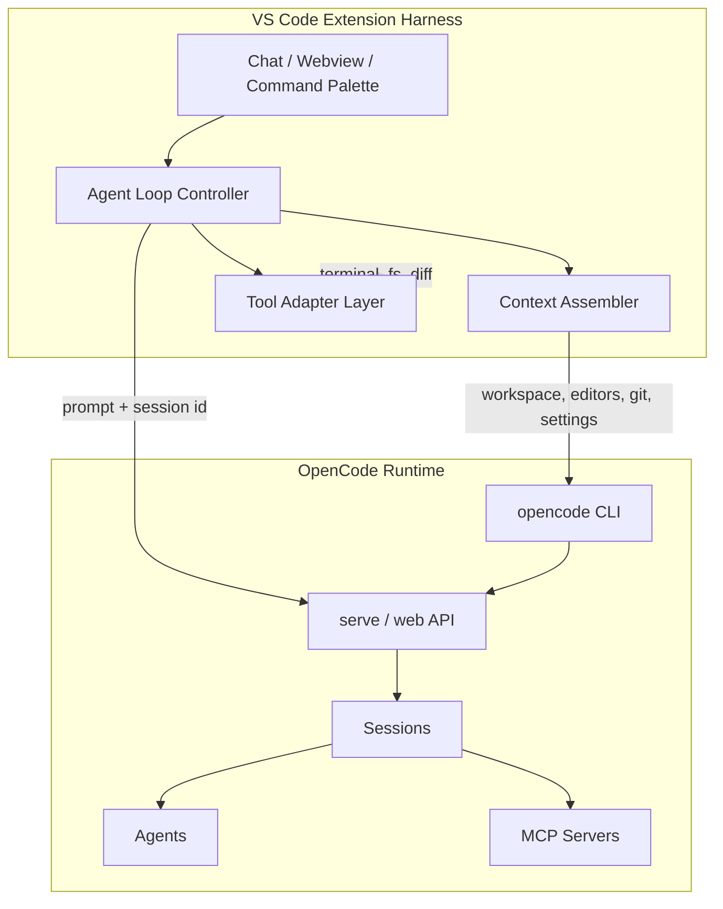
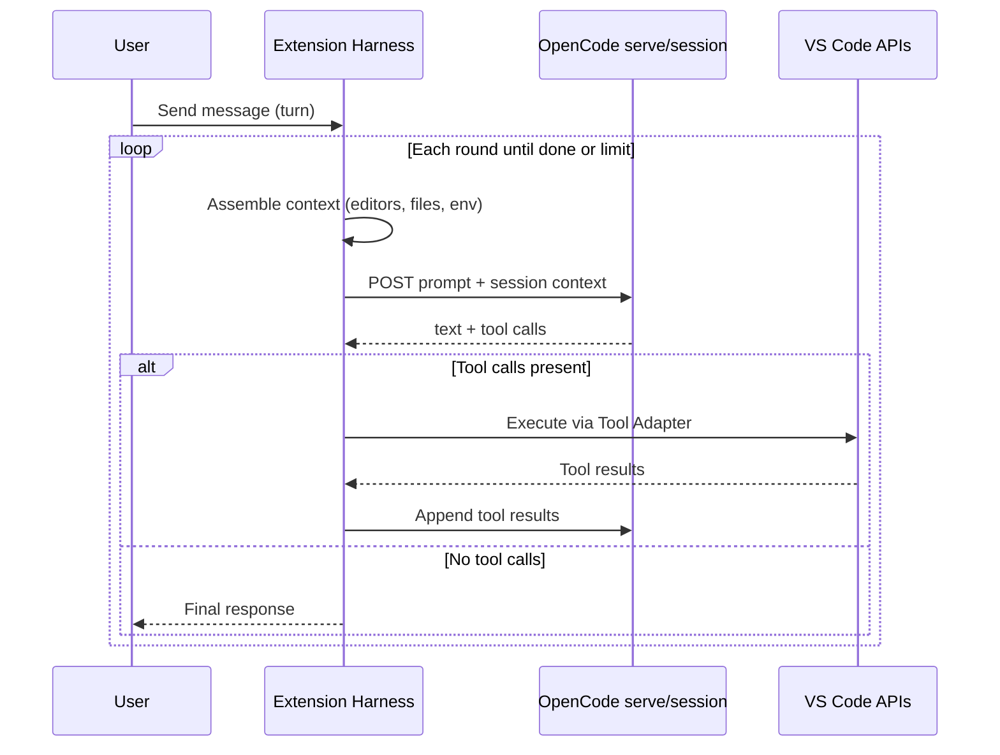

# Feature Plan: OpenCode Agent Loop in VS Code

> **Status:** Draft · **Target:** OpenCode Walkthrough extension  
> **Inspired by:** [The Coding Harness Behind GitHub Copilot in VS Code](https://code.visualstudio.com/blogs/2026/05/15/agent-harnesses-github-copilot-vscode) (May 2026)

## Summary

Build a **VS Code–native agent harness** that orchestrates OpenCode the way Copilot’s harness orchestrates models: assemble editor context, expose tools, run a **think → act → observe** loop, and surface results in the UI — while **OpenCode remains the execution engine** (CLI, TUI, agents, MCP, sessions).

Today this extension is primarily a **launcher and dashboard** (`sendToTerminal`, tree views, walkthroughs). This plan evolves it into a **thin harness layer** that bridges VS Code APIs and OpenCode’s agent runtime.

---

## Why this matters

The [VS Code blog](https://code.visualstudio.com/blogs/2026/05/15/agent-harnesses-github-copilot-vscode) argues that the **model is the engine; the harness is the car**. Developers experience:

1. **Context assembly** — what the agent sees before each step  
2. **Tool exposure** — which capabilities are available and when  
3. **Tool execution** — validation, running, error handling, feeding results back  
4. **Agent loop** — bounded iterations until the task completes or stops  

OpenCode already implements much of this in its CLI/TUI and via `opencode serve` / `opencode web`. The extension’s opportunity is to **integrate that loop with VS Code** (editors, terminals, diagnostics, SCM, MCP panel) instead of treating OpenCode as a black-box terminal command.

---

## Concept mapping: Copilot harness → OpenCode harness

| Copilot harness (VS Code) | OpenCode equivalent today | Extension harness (proposed) |
|---------------------------|---------------------------|----------------------------|
| System prompt + custom instructions | Agent config, `opencode.json`, `.agent.md` | Inject workspace + VS Code context into OpenCode session bootstrap |
| Workspace structure, open editors | `--file`, project cwd | `Run on Project Files` + **active editor / selection / diagnostics** |
| Tool: `read_file` | OpenCode read tool | VS Code `workspace.fs` + optional LSP symbols |
| Tool: `replace_string_in_file` / `apply_patch` | OpenCode edit tool | Route diffs through VS Code diff editor for review |
| Tool: `run_in_terminal` | OpenCode bash tool | Integrated terminal with trust + cwd from workspace folder |
| Tool: `semantic_search` | Scout subagent / grep | `@code` context via open files + git-aware file list |
| MCP tools | `opencode mcp add/list` | Reuse MCP tree view; sync enabled servers into session |
| Agent loop rounds | OpenCode session turns | Extension session controller polling `opencode session` API |
| Chat UI | OpenCode TUI / web | **VS Code webview or Chat participant** bound to session |
| Loop control (limits, cancel) | TUI interrupt / session limits | Cancel token + max rounds setting in extension |
| Evaluation (VSC-Bench style) | None in extension | Extension integration tests + scripted agent scenarios |

---

## Target architecture



### Agent loop (one user turn)



---

## Current baseline (v0.x extension)

| Capability | Status |
|------------|--------|
| Terminal dispatch (`sendToTerminal`) | ✅ |
| Env var export from settings | ✅ |
| Tree views (agents, models, MCP, sessions) | ✅ (CLI parse, read-only) |
| Walkthrough + webview docs | ✅ |
| Run on Project Files (file picker + prompt) | ✅ |
| In-editor agent loop | ❌ |
| Session resume from tree | ❌ |
| `opencode serve` / web integration | ❌ (terminal only) |
| Tool confirmation UI | ❌ |
| Loop limits / cancellation | ❌ |

---

## Phased implementation

### Phase 0 — Foundations (2–3 weeks)

**Goal:** Reliable bridge between extension and OpenCode runtime.

| Task | Description |
|------|-------------|
| 0.1 | **OpenCode health service** — `checkInstall()`, version, auth, model availability on activate |
| 0.2 | **Session API client** — wrap `opencode session list`, resume, create; JSON-first with text fallback |
| 0.3 | **`opencode serve` lifecycle** — start/stop headless server from extension; read port from output or config |
| 0.4 | **Fix launcher gaps** — Run Inline prompt input (#1), session tree resume (#8), MCP command consistency (#15) |

**Acceptance criteria**
- Extension detects CLI missing vs misconfigured vs ready
- Can list and resume a session from Sessions tree without opening a raw terminal dump
- Server starts on user command and exposes a documented local endpoint

**Branch:** `feat/agent-loop-foundations`

---

### Phase 1 — Context assembler (2 weeks)

**Goal:** Build the prompt envelope OpenCode receives each round (harness responsibility #1).

| Context signal | Source |
|----------------|--------|
| Workspace folder(s) | `vscode.workspace.workspaceFolders` |
| Active file + language | `window.activeTextEditor` |
| Selection / visible range | editor selection |
| Open editors list | `tabGroups.all` |
| Git branch + dirty files | existing `getGitBranch` + `git status` |
| Diagnostics (errors/warnings) | `languages.getDiagnostics` |
| User custom instructions | Settings: `opencode.harness.customInstructions` |
| Active agent / model | From OpenCode config or user picker |

**Deliverables**
- `src/context/assembleContext.js` (or `lib/context.js` if staying plain JS)
- Setting to toggle context sections (privacy-conscious defaults)
- Unit tests for context shape (no network)

**Acceptance criteria**
- Context JSON attached to every harness-initiated session
- User can disable sensitive sections (e.g. file contents) in Settings

**Branch:** `feat/agent-loop-context`

---

### Phase 2 — Tool adapter layer (3–4 weeks)

**Goal:** Map OpenCode tool invocations to VS Code when running in **hybrid mode** (harness executes VS Code–native tools).

| OpenCode tool | VS Code adapter behavior |
|---------------|--------------------------|
| Read / list files | `workspace.fs` + respect `.gitignore` |
| Edit / patch | Apply via `WorkspaceEdit`; optional preview in diff editor |
| Bash / terminal | `Terminal.sendText` with trust check + cwd |
| MCP | Delegate to OpenCode MCP stack; surface status in panel |

**Deliverables**
- Tool registry with JSON schemas (mirrors OpenCode tool names)
- **Confirmation gates** for destructive tools (settings: always / smart / never)
- Output channel `OpenCode Agent` for round-by-round logs (debug mode)

**Acceptance criteria**
- File edits from agent open as undoable VS Code edits
- Terminal commands require trusted workspace
- User can cancel in-flight tool execution

**Branch:** `feat/agent-loop-tools`

---

### Phase 3 — Agent loop controller (4–5 weeks)

**Goal:** Implement the **think → act → observe** loop in the extension, backed by OpenCode session/server API.

| Component | Behavior |
|-----------|----------|
| Loop controller | Max rounds (default 25), cancel button, progress indicator |
| Round state | Persist session id + round count in `globalState` |
| Summarization | Delegate compaction to OpenCode; extension shows “context compacted” toast |
| Stop conditions | No tool calls, user cancel, error threshold, max rounds |

**UI options (pick one for MVP, support both later)**

1. **Webview chat panel** — full control, matches Tips/Agents webview pattern  
2. **VS Code Chat participant** (`chatParticipants`) — native Chat UI (requires Copilot Chat API availability / fallback)

**Recommended MVP:** Webview sidebar view `opencode-walkthrough.agent` with:
- Message list (user / assistant / tool)
- Input box + agent/model picker
- Link to open full TUI (`opencode`) for power users

**Acceptance criteria**
- User sends one message; agent completes multi-step task (read → edit → run test) in one turn
- Cancel stops loop within one round
- Session appears in Sessions tree and is resumable

**Branch:** `feat/agent-loop-controller`

---

### Phase 4 — Evaluation & polish (ongoing)

**Goal:** Keep the harness honest as models and OpenCode evolve (inspired by [VSC-Bench / eval assessment](https://code.visualstudio.com/blogs/2026/05/15/agent-harnesses-github-copilot-vscode)).

| Task | Description |
|------|-------------|
| 4.1 | **Harness integration tests** — mock OpenCode server; assert loop stops correctly |
| 4.2 | **Scenario scripts** — `test/scenarios/fix-test.md` driving automated agent runs in CI (optional, containerized) |
| 4.3 | **PR label `~requires-eval-assessment`** — document manual eval checklist in PR template |
| 4.4 | **Metrics** — token usage via `opencode stats`; show in agent panel footer |

**Acceptance criteria**
- CI runs harness unit tests without live LLM
- Documented manual eval checklist for harness PRs
- No regression in existing 7 extension tests

**Branch:** `feat/agent-loop-eval`

---

## Proposed `package.json` contributions (Phase 3+)

```json
{
  "contributes": {
    "views": {
      "opencode-walkthrough": [
        { "id": "opencode-walkthrough.agent", "name": "Agent", "type": "webview" }
      ]
    },
    "commands": [
      { "command": "opencode-walkthrough.startAgent", "title": "OpenCode: Start Agent Session" },
      { "command": "opencode-walkthrough.cancelAgent", "title": "OpenCode: Cancel Agent" }
    ],
    "configuration": {
      "properties": {
        "opencode.harness.maxRounds": { "type": "number", "default": 25 },
        "opencode.harness.serverUrl": { "type": "string", "default": "http://127.0.0.1:4096" },
        "opencode.harness.autoStartServer": { "type": "boolean", "default": true },
        "opencode.harness.toolConfirmation": { "enum": ["always", "smart", "never"], "default": "smart" },
        "opencode.harness.customInstructions": { "type": "string", "default": "" }
      }
    }
  }
}
```

---

## Dependencies & risks

| Risk | Mitigation |
|------|------------|
| OpenCode server API undocumented / unstable | Phase 0 spike; pin CLI version in CI; graceful terminal fallback |
| Duplicating OpenCode TUI features | Position harness as **editor-integrated** layer; link out to TUI for advanced flows |
| Untrusted workspace terminal execution | Honor VS Code trust; disable bash adapter when untrusted |
| Token cost / long loops | Max rounds, stats footer, compact mode via OpenCode settings |
| Chat Participant API availability | Webview MVP first; Chat participant as Phase 3b |

---

## Success metrics

| Metric | Target (6 months post Phase 3) |
|--------|--------------------------------|
| Agent sessions started from VS Code | Track via optional telemetry opt-in or stats command |
| Task completion rate (manual eval scenarios) | ≥ 70% on 10 internal scenarios |
| Time to first edit | < 60s for “fix lint error in open file” scenario |
| User fallback to terminal TUI | Decreasing as harness matures |

---

## Related issues & docs

- #1 Run Inline Prompt behavior  
- #8 Session resume from tree  
- #22 Overview tree with CLI status  
- #23 Editor: Run selection with OpenCode  
- [OpenCode docs](https://opencode.ai/docs) — agents, MCP, sessions, serve/web  
- [Good first issues roadmap (#17)](https://github.com/aadorian/opencodeCLI/issues/17)

---

## Suggested epic breakdown (GitHub issues)

| Issue | Title | Phase |
|-------|-------|-------|
| Epic | OpenCode Agent Loop harness | — |
| Child | OpenCode serve lifecycle + session API client | 0 |
| Child | Context assembler for workspace/editor/git | 1 |
| Child | Tool adapter layer with confirmation gates | 2 |
| Child | Agent loop controller + webview chat UI | 3 |
| Child | Harness evaluation tests + PR eval checklist | 4 |

---

## Next action

1. Review and approve this plan (maintainer)  
2. Create epic issue + Phase 0 child issues  
3. Spike `opencode serve` API in Phase 0 (document endpoints in `docs/opencode-server-api.md`)  
4. Implement Phase 0 on branch `feat/agent-loop-foundations`
