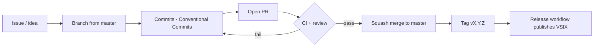

# Git Workflow

This project uses a **GitHub Flow**–inspired workflow: short-lived branches, pull requests, automated checks, and releases from tags.



## Branch strategy

| Branch | Purpose | Protected |
|--------|---------|-----------|
| `master` | Production-ready code | Yes — merge via PR only |
| `feat/*`, `fix/*`, … | Feature and fix work | No |
| `dependabot/*` | Dependency updates | No |

### Branch naming

Use lowercase with a **type prefix**:

```
<type>/<short-description>
```

| Prefix | Use for |
|--------|---------|
| `feat/` | New features |
| `fix/` | Bug fixes |
| `docs/` | Documentation only |
| `ci/` | CI/CD and GitHub Actions |
| `test/` | Tests |
| `refactor/` | Code refactoring |
| `chore/` | Maintenance, tooling |
| `build/` | Build or packaging |
| `perf/` | Performance |
| `style/` | Formatting, no logic change |

**Examples**

```bash
git checkout -b feat/auth-walkthrough-step
git checkout -b fix/sessions-empty-state-click
git checkout -b ci/add-release-workflow
```

## Commit messages

Follow [Conventional Commits](https://www.conventionalcommits.org/):

```
<type>(<optional scope>): <subject>

[optional body]

[optional footer: Closes #123]
```

**Types:** `feat`, `fix`, `docs`, `style`, `refactor`, `perf`, `test`, `build`, `ci`, `chore`, `revert`

**Examples**

```
feat: add walkthrough step for MCP servers
fix: wire Sessions empty-state to runInline command
docs: document git workflow for contributors
ci: add release workflow on version tags
```

### Commit template (optional)

Enable the project commit template locally:

```bash
git config commit.template .gitmessage
```

## Pull request workflow

1. **Sync** with `master` before opening a PR:
   ```bash
   git fetch origin
   git checkout master && git pull origin master
   git checkout -b feat/your-feature
   ```

2. **Develop** and test locally:
   ```bash
   npm ci
   npm run validate
   npm test
   ```
   Press **F5** in VS Code to test in the Extension Development Host.

3. **Push** and open a PR to `master`:
   ```bash
   git push -u origin feat/your-feature
   gh pr create --title "feat: your change" --body "Closes #N"
   ```

4. **PR title** must follow Conventional Commits (enforced by CI).

5. **Review** using [GitHub Pull Requests in VS Code](https://code.visualstudio.com/blogs/2018/09/10/introducing-github-pullrequests) or local checkout:
   ```bash
   git fetch origin pull/ID/head:pr-ID && git checkout pr-ID
   ```

6. **Merge** via **Squash and merge** after all checks pass and review is approved.

### Required CI checks

| Check | Workflow |
|-------|----------|
| Validate manifest + publish prerequisites | `ci.yml` |
| Extension tests (Ubuntu + macOS) | `ci.yml` |
| Package VSIX | `ci.yml` |
| Conventional PR title | `pull-request.yml` |
| Conventional commits in PR | `commitlint.yml` |
| Branch naming | `pull-request.yml` |

## Releases

Releases are **tag-driven**. Do not bump version on every merge — cut a release when ready to publish.

1. Update `version` in `package.json` and `CHANGELOG.md`
2. Commit: `chore: release v0.2.0`
3. Tag and push:
   ```bash
   git tag v0.2.0
   git push origin master --tags
   ```
4. The **Release** workflow builds a VSIX and attaches it to the GitHub Release.

## Fork workflow (external contributors)

```bash
git clone https://github.com/YOUR_USER/opencodeCLI.git
cd opencodeCLI
git remote add upstream https://github.com/aadorian/opencodeCLI.git
git fetch upstream
git checkout -b feat/my-change upstream/master
# ... changes ...
git push origin feat/my-change
# Open PR from your fork to aadorian/opencodeCLI master
```

Keep your fork updated:

```bash
git fetch upstream
git rebase upstream/master
```

## Automation summary

| Automation | File | Trigger |
|------------|------|---------|
| CI (test + package) | `.github/workflows/ci.yml` | push/PR to `master` |
| PR checks | `.github/workflows/pull-request.yml` | PR events |
| Commit lint | `.github/workflows/commitlint.yml` | PR sync |
| Release | `.github/workflows/release.yml` | push tag `v*` |
| Stale bot | `.github/workflows/stale.yml` | daily schedule |
| Ruleset sync | `.github/workflows/sync-ruleset.yml` | manual (maintainers) |
| Dependabot | `.github/dependabot.yml` | weekly |
| Auto-label PRs | `.github/labeler.yml` | PR sync |

## Branch protection (rulesets)

`master` is protected via a **GitHub Repository Ruleset** defined in [`.github/rulesets/master-protection.json`](./.github/rulesets/master-protection.json).

Maintainers apply or update it with:

```bash
node scripts/apply-ruleset.js --enforcement=disabled  # configure (no blocking)
node scripts/apply-ruleset.js --enforcement=active      # enforce
```

Or run **Actions → Sync Repository Ruleset**. See [branch-protection.md](./branch-protection.md).

---

- [CONTRIBUTING.md](../CONTRIBUTING.md)
- [Good first issues roadmap](https://github.com/aadorian/opencodeCLI/issues/17)
- [Pull request template](./PULL_REQUEST_TEMPLATE.md)
