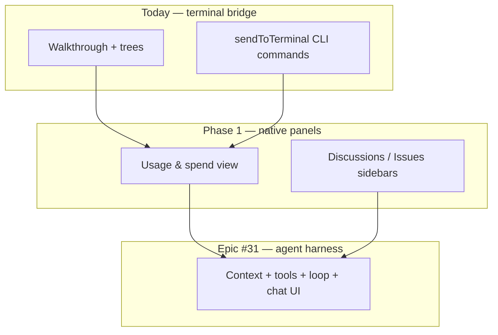

# OpenCode Walkthrough — Extension Roadmap

Strategic roadmap for the **OpenCode Walkthrough** VS Code extension, aligned with [GitHub issues](https://github.com/aadorian/opencodeCLI/issues), the [OpenCode CLI reference](https://opencode.ai/docs/cli/), and the [Agent Loop epic (#31)](https://github.com/aadorian/opencodeCLI/issues/31).

**Living checklist for contributors:** [#17 — Good first issues roadmap](https://github.com/aadorian/opencodeCLI/issues/17)

---

## Vision

Bring the full [OpenCode CLI](https://opencode.ai/docs/cli/) into VS Code as a first-class experience: walkthrough onboarding, sidebar trees, native panels for usage/spend, and eventually a VS Code–native agent harness powered by `opencode serve` + sessions.



---

## CLI coverage matrix

What the extension exposes today vs what the CLI supports ([docs](https://opencode.ai/docs/cli/)):

| CLI command | Extension today | Roadmap target |
| --- | --- | --- |
| `opencode` / TUI | ✅ Run Interactive | — |
| `opencode run` | ⚠️ [#1](https://github.com/aadorian/opencodeCLI/issues/1) broken inline flow | Fix + `run --file` [#23](https://github.com/aadorian/opencodeCLI/issues/23) |
| `opencode agent` | ✅ Trees + terminal | Walkthrough steps [#20–21](https://github.com/aadorian/opencodeCLI/issues/20) |
| `opencode auth` | ✅ Login / list | Walkthrough auth step [#20](https://github.com/aadorian/opencodeCLI/issues/20) |
| `opencode mcp` | ✅ Add / list | Standardize list [#15](https://github.com/aadorian/opencodeCLI/issues/15) |
| `opencode models` | ✅ Tree + list | Fix refresh [#14](https://github.com/aadorian/opencodeCLI/pull/35) · `--refresh` in tree |
| `opencode session` | ⚠️ List only; click broken [#8](https://github.com/aadorian/opencodeCLI/issues/8), [#11](https://github.com/aadorian/opencodeCLI/issues/11) | Resume from tree · harness [#31](https://github.com/aadorian/opencodeCLI/issues/31) |
| **`opencode stats`** | ⚠️ Terminal dump only | **Native spend view [#37](https://github.com/aadorian/opencodeCLI/issues/37)** |
| `opencode serve` / `web` | ✅ Terminal | Harness lifecycle [#31](https://github.com/aadorian/opencodeCLI/issues/31) |
| `opencode attach` | ❌ | Phase 2 — remote backend attach |
| `opencode export` / `import` | ❌ | Phase 2 — session portability |
| `opencode upgrade` | ✅ | — |
| `opencode github` | ❌ | Phase 3 — optional repo automation |
| `opencode plugin` / `pr` / `db` / `acp` | ❌ | Backlog |

---

## Phase 0 — Ship fixes (v0.0.2)

**Goal:** Correct broken UX found in exploratory testing. Unblocks walkthrough completion.

| Priority | Issue | CLI / area | Status |
| --- | --- | --- | --- |
| P0 | [#1](https://github.com/aadorian/opencodeCLI/issues/1) Run Inline Prompt runs diagnostics | `opencode run` | Open |
| P0 | [#14](https://github.com/aadorian/opencodeCLI/issues/14) Models Refresh → `refreshModels` | `models` tree | [PR #35](https://github.com/aadorian/opencodeCLI/pull/35) |
| P0 | [#11](https://github.com/aadorian/opencodeCLI/issues/11) Sessions empty-state click | `session` | Open |
| P0 | [#12](https://github.com/aadorian/opencodeCLI/issues/12) Agents empty-state CTA | `agent` | Open |
| P1 | [#3](https://github.com/aadorian/opencodeCLI/issues/3) Webview codicons | UI | Open |
| P1 | [#4](https://github.com/aadorian/opencodeCLI/issues/4) Install instructions drift | `upgrade` / install | Open |
| P1 | [#5](https://github.com/aadorian/opencodeCLI/issues/5) `opcode.enableExa` prefix | env vars | Open |
| P1 | [#7](https://github.com/aadorian/opencodeCLI/issues/7) Dead help activation event | manifest | Open |
| P1 | [#15](https://github.com/aadorian/opencodeCLI/issues/15) MCP list command mismatch | `mcp list` | Open |
| P2 | [#16](https://github.com/aadorian/opencodeCLI/issues/16) Version sync package.json ↔ README | release | Open |

**Milestone suggestion:** `v0.0.2 — bug fix release`

---

## Phase 1A — Core UX (v0.1.0)

**Goal:** Keyboard shortcuts, quick picks, and sidebar polish from [#17](https://github.com/aadorian/opencodeCLI/issues/17) Phase 2–3.

| Issue | Deliverable |
| --- | --- |
| [#2](https://github.com/aadorian/opencodeCLI/issues/2) | Register `contributes.keybindings` for documented shortcuts |
| [#18](https://github.com/aadorian/opencodeCLI/issues/18) | Quick pick descriptions (Show Actions, CLI Help) |
| [#19](https://github.com/aadorian/opencodeCLI/issues/19) | Explorer context menu — run on file |
| [#23](https://github.com/aadorian/opencodeCLI/issues/23) | Editor context — run on selection (`run --file`) |
| [#22](https://github.com/aadorian/opencodeCLI/issues/22) | Overview tree with live CLI status |
| [#25](https://github.com/aadorian/opencodeCLI/issues/25) | Help sidebar (CLI reference links) |
| [#10](https://github.com/aadorian/opencodeCLI/issues/10) | Declutter overview toolbar |
| [#6](https://github.com/aadorian/opencodeCLI/issues/6) | Rename MCP panel or move Sessions |

---

## Phase 1B — Usage & spend in VS Code ([#37](https://github.com/aadorian/opencodeCLI/issues/37))

**Goal:** **View token usage and additional spend natively in VS Code** using [`opencode stats`](https://opencode.ai/docs/cli/#stats) — not just a terminal dump.

### Why

The CLI already exposes cost and token data:

```bash
opencode stats                    # all-time summary
opencode stats --days 7           # last 7 days
opencode stats --models 5         # top 5 models by usage
opencode stats --project .        # current workspace only
```

Today the extension only runs `sendToTerminal('opencode stats')`. Users should see spend **in the sidebar** while coding.

### Proposed implementation

| Step | Work |
| --- | --- |
| 1 | Add **Usage** webview (mirror Discussions/Issues panel pattern) |
| 2 | Parse `opencode stats --format` output (or JSON if CLI adds it) |
| 3 | UI: total cost, input/output tokens, period filter (`--days`) |
| 4 | Model breakdown table (`--models N`) |
| 5 | Project scope: current workspace (`--project` with workspace path) |
| 6 | Settings: `opencode.usage.cacheMinutes`, default period |
| 7 | Replace or supplement status-bar **Stats** button to focus Usage view |
| 8 | Document in Tips, walkthrough, README |

### Acceptance criteria

- [ ] Usage view loads without opening integrated terminal
- [ ] Period chips map to `--days 7`, `--days 30`, all time
- [ ] Shows model-level cost breakdown when CLI supports `--models`
- [ ] Empty state when CLI not installed (link to Install)
- [ ] `opencode-walkthrough.stats` opens Usage view (terminal optional via link)

**Milestone suggestion:** `v0.1.0 — usage dashboard`

---

## Phase 2 — Onboarding & config (v0.2.0)

| Issue | Deliverable |
| --- | --- |
| [#20](https://github.com/aadorian/opencodeCLI/issues/20) | Walkthrough: Authenticate (`auth login`) |
| [#21](https://github.com/aadorian/opencodeCLI/issues/21) | Walkthrough: Connect MCP (`mcp add`) — [PR #34](https://github.com/aadorian/opencodeCLI/pull/34) |
| [#24](https://github.com/aadorian/opencodeCLI/issues/24) | Scaffold `opencode.json` template |
| [#26](https://github.com/aadorian/opencodeCLI/issues/26) | Windows/Linux shortcut hints in Tips |
| [#8](https://github.com/aadorian/opencodeCLI/issues/8) | Session tree resume (`session` + TUI flags) |
| New | `opencode attach` command for remote `serve`/`web` backends |
| New | Session export/import UI (`export` / `import`) |

---

## Phase 3 — Community & triage (parallel)

| Track | Issues / PRs |
| --- | --- |
| Discussions sidebar | Community examples hub |
| Issues triage sidebar | VS Code–style label filters |
| PR metadata automation | [PR #36](https://github.com/aadorian/opencodeCLI/pull/36) — CODEOWNERS, auto-labels |
| CI collaboration | [PR #29](https://github.com/aadorian/opencodeCLI/pull/29) |

---

## Phase 4 — Quality (ongoing)

| Issue | Deliverable |
| --- | --- |
| [#13](https://github.com/aadorian/opencodeCLI/issues/13) | Tree loading / error states |
| [#27](https://github.com/aadorian/opencodeCLI/issues/27) | Integration tests synced with manifest |
| [#28](https://github.com/aadorian/opencodeCLI/issues/28) | Hide status bar when CLI missing |
| [#9](https://github.com/aadorian/opencodeCLI/issues/9) | Overview tree provider (overlaps #22) |

---

## Epic — Agent Loop harness ([#31](https://github.com/aadorian/opencodeCLI/issues/31))

**Goal:** VS Code–native **think → act → observe** loop on top of OpenCode ([feature plan](./FEATURE_PLAN_opencode-agent-loop.md)).

| Phase | Focus | Key CLI |
| --- | --- | --- |
| 0 | Foundations | `serve`, `session list`, health checks |
| 1 | Context assembler | workspace, git, diagnostics |
| 2 | Tool adapter + confirmation | permissions, VS Code APIs |
| 3 | Agent loop + chat webview | `run --attach`, sessions |
| 4 | Eval tests + PR checklist | harness CI |

Depends on Phase 0 bug fixes (#1, #8, #14) and optionally Usage view (#37) for cost visibility in the agent panel footer.

---

## Release train

| Milestone | Due | Scope | Issues |
| --- | --- | --- | --- |
| [**v0.0.2**](https://github.com/aadorian/opencodeCLI/milestone/1) | 2026-07-15 | Bug fixes | #1, #3–#5, #7, #11–#12, #14–#16 |
| [**v0.1.0**](https://github.com/aadorian/opencodeCLI/milestone/2) | 2026-08-31 | UX + usage [#37](https://github.com/aadorian/opencodeCLI/issues/37) | #2, #6, #9–#10, #17–#19, #22–#23, #37 |
| [**v0.2.0**](https://github.com/aadorian/opencodeCLI/milestone/3) | 2026-10-31 | Onboarding & sessions | #8, #20–#21, #24–#26 |
| [**v0.3.0**](https://github.com/aadorian/opencodeCLI/milestone/4) | 2026-12-31 | Harness Phase 0–1 | #13, #27–#28, #31 |
| [**v1.0.0**](https://github.com/aadorian/opencodeCLI/milestone/5) | 2027-06-30 | Harness GA | Epic #31 Phases 2–4 |

All open issues and PRs are assigned. Details: [MILESTONES.md](./MILESTONES.md).

---

## How to use this roadmap

1. **Pick work:** Start with [#17](https://github.com/aadorian/opencodeCLI/issues/17) ordered list or any `good first issue`.
2. **Claim:** Comment on the issue before opening a PR.
3. **Branch:** `fix/…`, `feat/…`, or `docs/…` per [GIT_WORKFLOW.md](./GIT_WORKFLOW.md).
4. **PR metadata:** Use `Closes #N` — see [PR_METADATA.md](./PR_METADATA.md).
5. **Update:** Check off items here and in #17 when issues close.

---

## References

- [OpenCode CLI docs](https://opencode.ai/docs/cli/) — commands, flags, environment variables
- [OpenCode stats command](https://opencode.ai/docs/cli/#stats) — token usage and cost statistics
- [Extension milestones](./MILESTONES.md)
- [Good first issues #17](https://github.com/aadorian/opencodeCLI/issues/17)
- [Usage & spend in VS Code #37](https://github.com/aadorian/opencodeCLI/issues/37)
- [Agent Loop epic #31](https://github.com/aadorian/opencodeCLI/issues/31)
