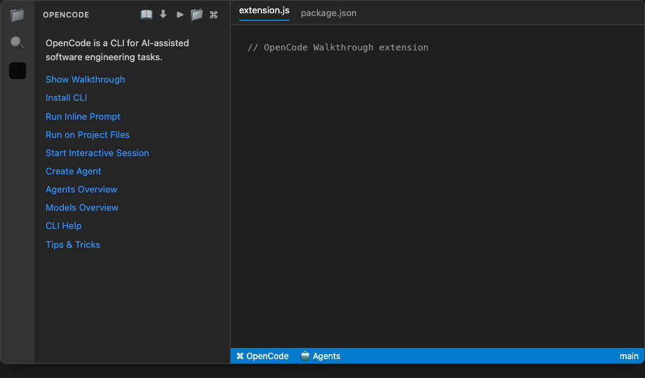
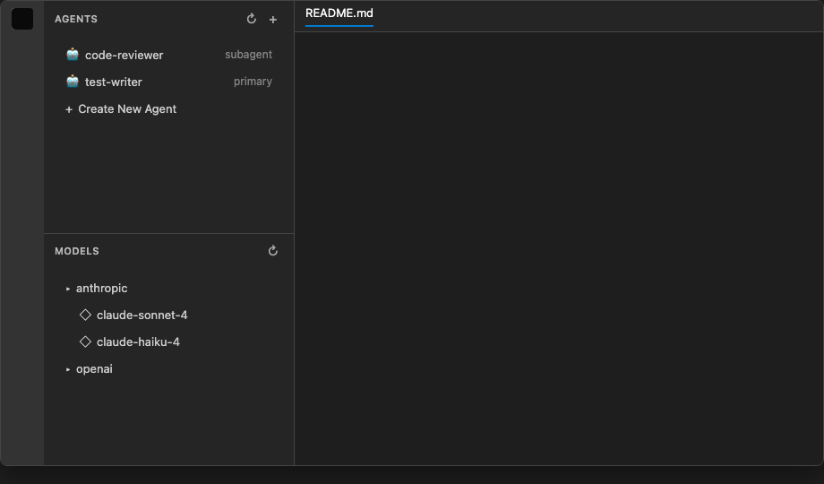
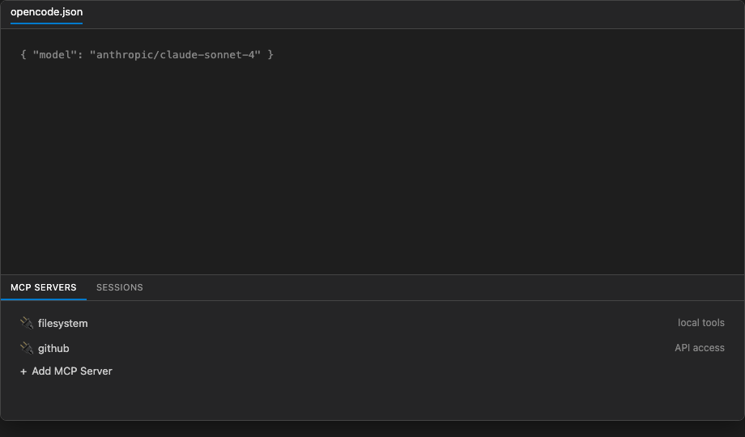
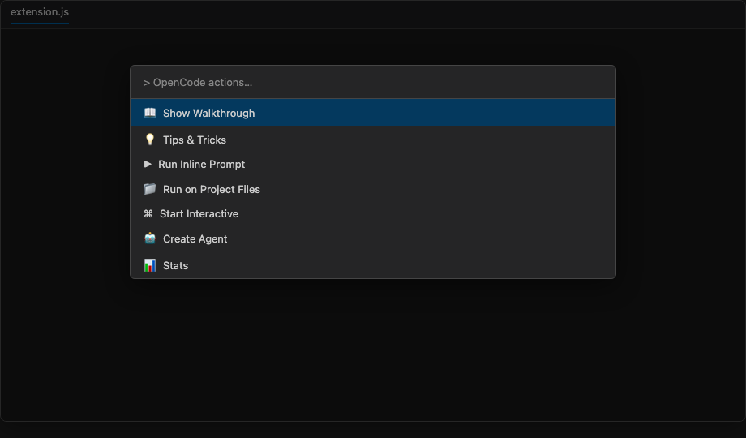
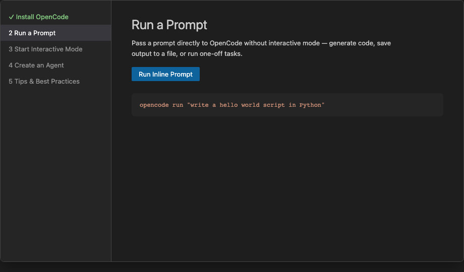
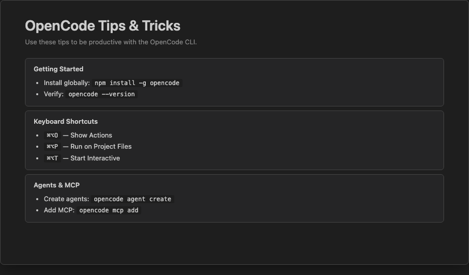
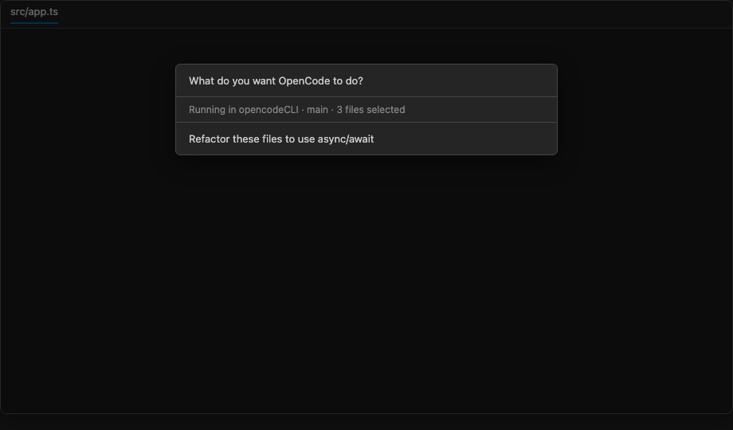

# OpenCode Walkthrough

A Visual Studio Code extension that provides an interactive walkthrough and quick actions for [OpenCode](https://opencode.ai), an AI-assisted CLI for software engineering tasks.

**Publisher:** `AlejandroAdorjan` | **License:** SEE LICENSE IN LICENSE | **Pricing:** Free  
**Website:** [aadorian.github.io/opencodeCLI](https://aadorian.github.io/opencodeCLI/) · **Install:** [VS Code Marketplace](https://marketplace.visualstudio.com/items?itemName=AlejandroAdorjan.opencode-walkthrough)

Browse screenshots, install steps, and documentation on the **[project website](https://aadorian.github.io/opencodeCLI/)**.

---

## Screenshots

Each image below matches the extension UI in VS Code — sidebar links, toolbar buttons, quick picks, and panel actions as shipped in v0.0.2.

### Activity bar & sidebar overview

Open the **OpenCode** activity bar view for one-click access to walkthrough, CLI, and overview panels.

**Welcome links shown:**

- Show Walkthrough · Install CLI · Run Inline Prompt · Run on Project Files
- Start Interactive Session · Start Agent Session · Create Agent
- Agents Overview · Models Overview · CLI Help · Tips & Tricks · Read Documentation

**Status bar:** `$(zap) OpenCode` (Show Actions) · `$(hubot) Agents` (List Agents)



### Agents & models tree views

Live data from `opencode agent list` and `opencode models` in the sidebar.

**Agents view:** `code-reviewer` (subagent), `test-writer` (primary), **Create New Agent**  
**Models view:** provider groups (e.g. anthropic → claude-sonnet-4, claude-haiku-4), refresh toolbar



### MCP servers & sessions panel

Bottom panel container **MCP Servers** with two tabs.

**MCP Servers tab:** listed servers (e.g. filesystem, github) · **Add MCP Server**  
**Sessions tab:** recent sessions · refresh toolbar · empty-state links to Run Inline Prompt / Start Agent Session / Start Interactive Session



### Show Actions quick pick

Open from the status bar (`⌘⌥O` on macOS) or command **OpenCode: Show Actions**.

**Quick pick entries (partial list shown in UI):**

- Show Walkthrough · Tips & Tricks · Run Inline Prompt · Run on Project Files
- Start Interactive · Create Agent · Stats

Full menu also includes Install CLI, Agents/Models overview, Auth Login/List, MCP add/list, List Models/Sessions, Start Server, Start Web, and Upgrade CLI.



### Getting Started walkthrough

Built-in walkthrough **Get Started with OpenCode** (`opencode.gettingStarted`).

**Steps:** Install OpenCode · Run a Prompt · Start Interactive Mode · Create an Agent · Tips & Best Practices



### Tips & Tricks webview

In-editor reference panel opened via **OpenCode: Tips & Tricks**.

**Sections shown:** Getting Started (`curl -fsSL https://opencode.ai/install | bash`) · Keyboard Shortcuts (`⌘⌥O`, `⌘⌥P`, `⌘⌥T`) · Agents & MCP (`opencode agent create`, `opencode mcp add`)



### Run on Project Files

Command **OpenCode: Run on Project Files** (`⌘⌥P`) — pick workspace files, enter a prompt, run in the integrated terminal.

**Dialog:** branch context (e.g. `main`) · file count · prompt input (e.g. “Refactor these files to use async/await”)



---

## Table of Contents

- [Screenshots](#screenshots)
- [Architecture](#architecture)
- [Extension Entry Point](#extension-entry-point)
- [Activation Events](#activation-events)
- [Contributions (package.json)](#contributions-packagejson)
  - [View Containers](#view-containers)
  - [Views](#views)
  - [Commands](#commands)
  - [Views Welcome](#views-welcome)
  - [Menus](#menus)
  - [Submenus](#submenus)
  - [Walkthrough](#walkthrough)
  - [Start Entries](#start-entries)
- [Project Structure](#project-structure)
- [Development](#development)
- [Contributing & Git Workflow](#contributing--git-workflow)
- [Testing](#testing)
- [Publishing](#publishing)
- [Release History](#release-history)

---

## Architecture

The extension is a plain JavaScript VS Code extension (no transpiler) that follows the standard `activate`/`deactivate` lifecycle. It registers commands, status bar items, and contributes a walkthrough, views, and menus declaratively via `package.json`.

### Core Flow

```
VS Code starts
  └─ Activation events trigger activate()
       ├─ Register 18 commands (all push to context.subscriptions)
       ├─ Create 2 status bar items (OpenCode + Agents)
       └─ All commands use sendToTerminal() except:
            ├─ showWalkthrough → opens the walkthrough page
            ├─ showActions    → opens a quick-pick menu
            └─ showCliHelp    → opens a CLI reference quick-pick
```

### sendToTerminal()

The shared utility function routes command output to the VS Code integrated terminal:

```js
function sendToTerminal(text) {
  const terminal = vscode.window.activeTerminal
    ?? vscode.window.createTerminal('OpenCode');
  terminal.show();
  terminal.sendText(text);
}
```

- Reuses the active terminal if one exists.
- Falls back to creating a new terminal named `OpenCode`.
- Focuses the terminal before sending text.

---

## Extension Entry Point

**File:** `extension.js`

### Module Exports

```js
module.exports = { activate, deactivate };
```

### Lifecycle

| Function | Description |
|---|---|
| `activate(context)` | Registers all commands, creates status bar items, pushes all disposables to `context.subscriptions` |
| `deactivate()` | No-op; cleanup handled by VS Code disposing subscriptions |

### Commands Registered

| Command | Handler | Terminal Command |
|---|---|---|
| `opencode-walkthrough.showWalkthrough` | Opens walkthrough via `workbench.action.openWalkthrough` | — |
| `opencode-walkthrough.install` | `sendToTerminal` | `curl -fsSL https://opencode.ai/install \| bash` (or `npm install -g opencode-ai` on Windows) |
| `opencode-walkthrough.runInline` | input box + terminal | `opencode run "your prompt"` |
| `opencode-walkthrough.runInteractive` | `sendToTerminal` | `opencode` |
| `opencode-walkthrough.createAgent` | `sendToTerminal` | `opencode agent create` |
| `opencode-walkthrough.listAgents` | `sendToTerminal` | `opencode agent list` |
| `opencode-walkthrough.addMcp` | `sendToTerminal` | `opencode mcp add` |
| `opencode-walkthrough.listMcp` | `sendToTerminal` | `opencode mcp list` |
| `opencode-walkthrough.showActions` | `vscode.window.showQuickPick` with 16 actions | — |
| `opencode-walkthrough.showCliHelp` | `vscode.window.showQuickPick` with 14 CLI reference items | — |
| `opencode-walkthrough.authLogin` | `sendToTerminal` | `opencode auth login` |
| `opencode-walkthrough.authList` | `sendToTerminal` | `opencode auth ls` |
| `opencode-walkthrough.listModels` | `sendToTerminal` | `opencode models` |
| `opencode-walkthrough.sessionList` | `sendToTerminal` | `opencode session list` |
| `opencode-walkthrough.stats` | `sendToTerminal` | `opencode stats` |
| `opencode-walkthrough.upgrade` | `sendToTerminal` | `opencode upgrade` |
| `opencode-walkthrough.serve` | `sendToTerminal` | `opencode serve` |
| `opencode-walkthrough.web` | `sendToTerminal` | `opencode web` |

### Status Bar Items

| Priority | Alignment | Text | Tooltip | Command on Click |
|---|---|---|---|---|
| 100 | Left | `$(terminal) OpenCode` | OpenCode — Click to run an action | `opencode-walkthrough.showActions` |
| 99 | Left | `$(robot) Agents` | OpenCode Agents — Click to list agents | `opencode-walkthrough.listAgents` |

### Quick Pick Menus

**`showActions`** — 16 items:

```
$(book) Show Walkthrough
$(cloud-download) Install CLI
$(play) Run Inline Prompt
$(terminal) Start Interactive
$(robot) Create Agent
$(list-tree) List Agents
$(key) Auth Login
$(key) Auth List
$(plug) Add MCP Server
$(list-tree) List MCP Servers
$(symbol-parameter) List Models
$(list-tree) List Sessions
$(graph) Stats
$(server) Start Server
$(globe) Start Web
$(arrow-up) Upgrade CLI
```

**`showCliHelp`** — 14 CLI reference items with command descriptions:

---

## Activation Events

The extension activates lazily on any of these triggers (`package.json` `activationEvents`):

| Event | Trigger |
|---|---|
| `onCommand:opencode-walkthrough.showWalkthrough` | Running the Show Walkthrough command |
| `onCommand:opencode-walkthrough.install` | Running Install CLI |
| `onCommand:opencode-walkthrough.runInline` | Running Run Inline Prompt |
| `onCommand:opencode-walkthrough.runInteractive` | Running Start Interactive Session |
| `onWalkthrough:opencode.gettingStarted` | Opening the walkthrough |
| `onView:opencode-walkthrough.overview` | Revealing the sidebar view |
| `onCommand:opencode-walkthrough.showActions` | Running Show Actions |
| `onCommand:opencode-walkthrough.createAgent` | Running Create Agent |
| `onCommand:opencode-walkthrough.listAgents` | Running List Agents |
| `onView:opencode-walkthrough.mcp` | Revealing the MCP panel view |
| `onCommand:opencode-walkthrough.addMcp` | Running Add MCP Server |
| `onCommand:opencode-walkthrough.listMcp` | Running List MCP Servers |
| `onCommand:opencode-walkthrough.authLogin` | Running Auth Login |
| `onCommand:opencode-walkthrough.authList` | Running Auth List |
| `onCommand:opencode-walkthrough.listModels` | Running List Models |
| `onCommand:opencode-walkthrough.sessionList` | Running List Sessions |
| `onCommand:opencode-walkthrough.stats` | Running Stats |
| `onCommand:opencode-walkthrough.upgrade` | Running Upgrade CLI |
| `onCommand:opencode-walkthrough.serve` | Running Start Server |
| `onCommand:opencode-walkthrough.web` | Running Start Web Interface |
| `onCommand:opencode-walkthrough.showCliHelp` | Opening CLI Help quick pick |

---

## Contributions (package.json)

### View Containers

Two view containers are contributed:

**Activity Bar — `opencode-walkthrough`**
- ID: `opencode-walkthrough`
- Title: "OpenCode"
- Icon: `media/opencode-icon.png`

**Panel — `opencode-mcp`**
- ID: `opencode-mcp`
- Title: "MCP Servers"
- Icon: `media/opencode-icon.png`

### Views

| Container ID | View ID | Type | Name |
|---|---|---|---|
| `opencode-walkthrough` | `opencode-walkthrough.overview` | tree | OpenCode |
| `opencode-mcp` | `opencode-walkthrough.mcp` | tree | MCP Servers |

### Commands

18 commands contributed with `$(product-icon)` references:

```json
{
  "opencode-walkthrough.showWalkthrough": "$(book)",
  "opencode-walkthrough.install":          "$(cloud-download)",
  "opencode-walkthrough.runInline":        "$(play)",
  "opencode-walkthrough.runInteractive":   "$(terminal)",
  "opencode-walkthrough.createAgent":      "$(robot)",
  "opencode-walkthrough.listAgents":       "$(list-tree)",
  "opencode-walkthrough.authLogin":        "$(key)",
  "opencode-walkthrough.authList":         "$(key)",
  "opencode-walkthrough.addMcp":           "$(plug)",
  "opencode-walkthrough.listMcp":          "$(list-tree)",
  "opencode-walkthrough.listModels":       "$(symbol-parameter)",
  "opencode-walkthrough.sessionList":      "$(list-tree)",
  "opencode-walkthrough.stats":            "$(graph)",
  "opencode-walkthrough.serve":            "$(server)",
  "opencode-walkthrough.web":              "$(globe)",
  "opencode-walkthrough.upgrade":          "$(arrow-up)",
  "opencode-walkthrough.showActions":      "(no icon)",
  "opencode-walkthrough.showCliHelp":      "$(question)"
}
```

### Views Welcome

**Sidebar view (`opencode-walkthrough.overview`):**
```
OpenCode is a CLI for AI-assisted software engineering tasks.

[Show Walkthrough](command:opencode-walkthrough.showWalkthrough)
[Install CLI](command:opencode-walkthrough.install)
[Run Inline Prompt](command:opencode-walkthrough.runInline)
[Run on Project Files](command:opencode-walkthrough.runOnProject)
[Start Interactive Session](command:opencode-walkthrough.runInteractive)
[Start Agent Session](command:opencode-walkthrough.startAgent)
[Create Agent](command:opencode-walkthrough.createAgent)

[Agents Overview](command:opencode-walkthrough.showAgents)
[Models Overview](command:opencode-walkthrough.showModels)

[CLI Help](command:opencode-walkthrough.showCliHelp)
[Tips & Tricks](command:opencode-walkthrough.showTips)
[Read Documentation](https://opencode.ai)
```

**MCP Panel view (`opencode-walkthrough.mcp`):**
```
Manage Model Context Protocol servers for OpenCode.

[Add MCP Server](command:opencode-walkthrough.addMcp)
[List MCP Servers](command:opencode-walkthrough.listMcp)

[Read MCP Docs](https://opencode.ai/docs/mcp-servers/)
```

### Menus

**`menubar`** — Help menu bar integration:

| Menu | Item |
|---|---|
| Help → **OpenCode CLI** (submenu) | CLI Help, Run Inline, Interactive, Create Agent, List Agents, Auth Login, Auth List, Add MCP, List MCP, List Models, List Sessions, Stats, Serve, Web, Upgrade |

**`view/title`** — Toolbar buttons shown in view headers:

| View | Buttons |
|---|---|
| `opencode-walkthrough.overview` | Show Walkthrough, Install CLI, Run Inline Prompt, Start Interactive, Create Agent, CLI Help |
| `opencode-walkthrough.mcp` | Add MCP Server, List MCP Servers |

**`explorer/context`** — Explorer right-click (only on folders):
- Shows submenu `opencode-walkthrough.submenu`

### Submenus

**ID:** `opencode-walkthrough.submenu` — **Label:** "OpenCode"  
**ID:** `opencode-walkthrough.helpSubmenu` — **Label:** "OpenCode CLI" (shown in Help menu)

Items when right-clicking a folder:

| Command | Title |
|---|---|
| `opencode-walkthrough.runInline` | OpenCode: Run Inline Prompt |
| `opencode-walkthrough.runInteractive` | OpenCode: Start Interactive Session |
| `opencode-walkthrough.createAgent` | OpenCode: Create Agent |
| `opencode-walkthrough.addMcp` | OpenCode: Add MCP Server |

### Walkthrough

**ID:** `opencode.gettingStarted` — **Title:** "Get Started with OpenCode"

5 sequential steps:

| Step | ID | Title | Completion Event |
|---|---|---|---|
| 1 | `opencode.install` | Install OpenCode | `onCommand:opencode-walkthrough.install` |
| 2 | `opencode.runInline` | Run a Prompt | `onCommand:opencode-walkthrough.runInline` |
| 3 | `opencode.runInteractive` | Start Interactive Mode | `onCommand:opencode-walkthrough.runInteractive` |
| 4 | `opencode.createAgent` | Create an Agent | `onCommand:opencode-walkthrough.createAgent` |
| 5 | `opencode.tips` | Tips & Best Practices | `onView:terminal`, `onLink:https://opencode.ai` |

Each step has a markdown media file in `walkthroughs/` (e.g. `01-install.md`) and an SVG illustration in `media/walkthrough/`.

### Start Entries

A "folder" category start entry is contributed:
- **Title:** "Get Started with OpenCode"
- **Command:** `opencode-walkthrough.showWalkthrough`

---

## Project Structure

```
opencode-vscode-walkthrough/
├── .vscode/
│   └── launch.json              # Debug configs: Run Extension + Extension Tests
├── .vscode-test.mjs             # Test runner config (mocha TDD, user-data-dir)
├── .vscodeignore                # Files excluded from VSIX packaging
├── .env.example                 # Environment variables template
├── extension.js                 # Main extension entry point
├── package.json                 # Manifest with all contributions
├── media/
│   ├── opencode-icon.png        # PNG icon (128x128, for marketplace)
│   ├── opencode-icon.svg        # SVG source (codicon-style, not packaged)
│   └── walkthrough/
│       ├── agent.svg
│       ├── inline.svg
│       ├── install.svg
│       ├── interactive.svg
│       └── tips.svg
├── walkthroughs/
│   ├── 01-install.md
│   ├── 02-run-inline.md
│   ├── 03-run-interactive.md
│   ├── 04-create-agent.md
│   └── 05-tips.md
└── test/
    └── extension.test.js        # 7 integration tests
```

### File Details

| File | Purpose |
|---|---|
| `extension.js` | Plain JS. Registers 18 commands + 2 status bar items. |
| `package.json` | Manifest with all contributions: views, menus, walkthrough, 18 commands, submenus. |
| `.vscodeignore` | Excludes `.vscode-test/`, `test/`, SVG icons, etc. from VSIX. |
| `.vscode-test.mjs` | ES module config for `@vscode/test-cli`. Uses `/tmp` for user-data-dir to avoid macOS socket path length limit. |

---

## Development

### Prerequisites

- [VS Code](https://code.visualstudio.com/) 1.74+
- [Node.js](https://nodejs.org/) 18+
- [OpenCode CLI](https://opencode.ai) (optional, for testing commands)

Regenerate README screenshots (requires Playwright):

```bash
npm run screenshots
```

### Configuration Settings

This extension contributes OpenCode CLI settings that can be configured in **Settings** → **OpenCode**. Each maps to a CLI environment variable ([full list](https://opencode.ai/docs/cli/#environment-variables)) and is automatically exported when running commands.

| Setting | Env Variable | Type |
|---|---|---|
| `opencode.configPath` | `OPENCODE_CONFIG` | string |
| `opencode.configDir` | `OPENCODE_CONFIG_DIR` | string |
| `opencode.tuiConfigPath` | `OPENCODE_TUI_CONFIG` | string |
| `opencode.autoShare` | `OPENCODE_AUTO_SHARE` | boolean |
| `opencode.modelsUrl` | `OPENCODE_MODELS_URL` | string |
| `opencode.serverPassword` | `OPENCODE_SERVER_PASSWORD` | string |
| `opencode.serverUsername` | `OPENCODE_SERVER_USERNAME` | string |
| `opencode.logLevel` | `--log-level` flag | enum |
| `opencode.disableAutoUpdate` | `OPENCODE_DISABLE_AUTOUPDATE` | boolean |
| `opencode.disablePrune` | `OPENCODE_DISABLE_PRUNE` | boolean |
| `opencode.disableTerminalTitle` | `OPENCODE_DISABLE_TERMINAL_TITLE` | boolean |
| `opencode.disableDefaultPlugins` | `OPENCODE_DISABLE_DEFAULT_PLUGINS` | boolean |
| `opencode.disableLspDownload` | `OPENCODE_DISABLE_LSP_DOWNLOAD` | boolean |
| `opencode.disableAutoCompact` | `OPENCODE_DISABLE_AUTOCOMPACT` | boolean |
| `opencode.disableClaudeCode` | `OPENCODE_DISABLE_CLAUDE_CODE` | boolean |
| `opencode.disableModelsFetch` | `OPENCODE_DISABLE_MODELS_FETCH` | boolean |
| `opencode.enableExa` | `OPENCODE_ENABLE_EXA` | boolean |
| `opencode.experimental` | `OPENCODE_EXPERIMENTAL` | boolean |
| `opencode.experimental.planMode` | `OPENCODE_EXPERIMENTAL_PLAN_MODE` | boolean |
| `opencode.experimental.backgroundSubagents` | `OPENCODE_EXPERIMENTAL_BACKGROUND_SUBAGENTS` | boolean |
| `opencode.experimental.nativeLlm` | `OPENCODE_EXPERIMENTAL_NATIVE_LLM` | boolean |
| `opencode.experimental.scout` | `OPENCODE_EXPERIMENTAL_SCOUT` | boolean |
| `opencode.experimental.workspaces` | `OPENCODE_EXPERIMENTAL_WORKSPACES` | boolean |

Settings are read when sending terminal commands and prepended as `export` statements.

### Environment Variables

Copy `.env.example` to `.env` and configure your paths and tokens:

```bash
cp .env.example .env
```

| Variable | Description |
|---|---|
| `EXTENSION_PATH` | Absolute path to the extension directory |
| `VSCE_PAT` | VS Code Marketplace PAT ([docs](https://code.visualstudio.com/docs/configure/extensions/extension-marketplace)) |
| `OVSX_PAT` | Open VSX Registry PAT ([open-vsx.org](https://open-vsx.org/user-settings/tokens)) |

### Setup

```bash
npm install
```

### Run Extension

Launch the Extension Development Host (opens a new Cursor/VS Code window with this extension loaded):

```bash
npm run run
```

This runs `scripts/run-extension.js`, which looks for a supported IDE CLI on your PATH in this order: **`code`** (VS Code) → **`code-insiders`** (VS Code Insiders) → **`cursor`**. If none are found, it prints download links for each editor. Override paths with environment variables:

| Variable | Default | Purpose |
|----------|---------|---------|
| `EXTENSION_PATH` | Repository root | Directory containing `package.json` |
| `WORKSPACE_FOLDER` | Same as extension path | Folder opened in the dev host |

Alternatives:

- Press **F5** in VS Code/Cursor with the **Run Extension** launch config (`.vscode/launch.json`).
- CLI directly (replace `code` with `code-insiders` or `cursor` as needed):

  ```bash
  code --extensionDevelopmentPath="/absolute/path/to/opencodeCLI" "/absolute/path/to/opencodeCLI"
  ```

For more on sideloading extensions, see the [VS Code extension marketplace docs](https://code.visualstudio.com/docs/configure/extensions/extension-marketplace).

### Package

```bash
npx @vscode/vsce package
```

Outputs `opencode-walkthrough-0.0.1.vsix`.

---

## Contributing & Git Workflow

We use **GitHub Flow** with Conventional Commits, automated CI, and tag-based releases.

| Topic | Guide |
|-------|-------|
| Full git workflow | [.github/GIT_WORKFLOW.md](./.github/GIT_WORKFLOW.md) |
| Contributing | [CONTRIBUTING.md](./CONTRIBUTING.md) |
| Branch protection (rulesets) | [.github/branch-protection.md](./.github/branch-protection.md) |
| Ruleset definition | [.github/rulesets/master-protection.json](./.github/rulesets/master-protection.json) |
| Good first issues | [Issue #17](https://github.com/aadorian/opencodeCLI/issues/17) |
| Agent Loop feature plan | [.github/FEATURE_PLAN_opencode-agent-loop.md](./.github/FEATURE_PLAN_opencode-agent-loop.md) |
| Building the agent harness (wiki) | [GitHub Wiki](https://github.com/aadorian/opencodeCLI/wiki) · [docs/building-opencode-agent-harness.md](./docs/building-opencode-agent-harness.md) · sync: `npm run wiki:push` |

```bash
git checkout -b feat/my-change
npm run validate && npm test
git commit -m "feat: describe change"
gh pr create --title "feat: describe change"
```

Enable the commit template: `git config commit.template .gitmessage`

---

## Testing

Uses `@vscode/test-cli` with `@vscode/test-electron`.

### Test Suite

7 tests in `test/extension.test.js` plus 8 harness unit tests in `test/harness.test.js` (17 total):

| Test | Description |
|---|---|
| Extension is installed and activates | Verifies extension is found and active |
| All commands are registered | Asserts all 18 expected commands exist |
| Commands can be executed | Runs `showWalkthrough` without error |
| Status bar items are created | Verifies `createStatusBarItem` API availability |
| Views are contributed | Verifies `createTreeView` API availability |
| Extension manifest is valid | Checks `name`, `publisher`, `contributes` fields |
| Walkthrough step can be opened | Opens walkthrough via `workbench.action.openWalkthrough` |

### Run Tests

```bash
npm test
```

The config `.vscode-test.mjs` sets `user-data-dir` to a short `/tmp` path to avoid the macOS IPC socket 103-character limit.

### Debug Tests

Use the "Extension Tests" launch config in `.vscode/launch.json`.

---

## Publishing

See the wiki article **[Publishing & CI/CD](https://github.com/aadorian/opencodeCLI/wiki/Publishing-and-CI-CD)** and [docs/publishing-cicd.md](./docs/publishing-cicd.md) for the full pipeline (validate → test → package → tag release → Marketplace).

### VS Code Marketplace

Publish using the token from your `.env` or pass it directly:

```bash
source .env && npx @vscode/vsce publish -p "$VSCE_PAT"
```

See the [VS Code extension marketplace docs](https://code.visualstudio.com/docs/configure/extensions/extension-marketplace) for token setup.

### Open VSX Registry

```bash
source .env && npx ovsx publish opencode-walkthrough-0.0.1.vsix -p "$OVSX_PAT"
```

Get a token at https://open-vsx.org/user-settings/tokens

---

## Release History

See [CHANGELOG.md](./CHANGELOG.md) for detailed notes. Tags link to [GitHub Releases](https://github.com/aadorian/opencodeCLI/releases).

| Tag | Highlights |
| --- | --- |
| [v0.19.0](https://github.com/aadorian/opencodeCLI/releases/tag/v0.19.0) | Run on Project Files command with file picker, branch detection, and keybinding |
| [v0.18.0](https://github.com/aadorian/opencodeCLI/releases/tag/v0.18.0) | Keyboard shortcuts for main commands; shortcuts listed in sidebar welcome |
| [v0.17.1](https://github.com/aadorian/opencodeCLI/releases/tag/v0.17.1) | Configuration settings table for OpenCode CLI environment variables |
| [v0.17.0](https://github.com/aadorian/opencodeCLI/releases/tag/v0.17.0) | OpenCode configuration settings mapped to CLI environment variables |
| [v0.16.0](https://github.com/aadorian/opencodeCLI/releases/tag/v0.16.0) | Stats toolbar button in editor title and sidebar |
| [v0.15.1](https://github.com/aadorian/opencodeCLI/releases/tag/v0.15.1) | Run Inline shows version, configured providers, and available models |
| [v0.15.0](https://github.com/aadorian/opencodeCLI/releases/tag/v0.15.0) | Install check before run; version notification and GitHub install link |
| [v0.14.0](https://github.com/aadorian/opencodeCLI/releases/tag/v0.14.0) | Verify OpenCode install before install command; show version if present |
| [v0.13.0](https://github.com/aadorian/opencodeCLI/releases/tag/v0.13.0) | `.env` setup for paths and credentials; marketplace documentation links |
| [v0.12.0](https://github.com/aadorian/opencodeCLI/releases/tag/v0.12.0) | Help menu integration, 9 new CLI commands, secondary sidebar view, 18 total commands |
| [v0.11.1](https://github.com/aadorian/opencodeCLI/releases/tag/v0.11.1) | Add `sudo` to install command |
| [v0.11.0](https://github.com/aadorian/opencodeCLI/releases/tag/v0.11.0) | Architectural README documenting all components |
| [v0.10.0](https://github.com/aadorian/opencodeCLI/releases/tag/v0.10.0) | Comprehensive README |
| [v0.9.0](https://github.com/aadorian/opencodeCLI/releases/tag/v0.9.0) | Replace SVG icon with PNG for marketplace |
| [v0.8.0](https://github.com/aadorian/opencodeCLI/releases/tag/v0.8.0) | Integration test suite (7 tests) |
| [v0.7.0](https://github.com/aadorian/opencodeCLI/releases/tag/v0.7.0) | Explorer context menu, Create Agent step, Agents status bar |
| [v0.6.0](https://github.com/aadorian/opencodeCLI/releases/tag/v0.6.0) | MCP Servers panel view container |
| [v0.5.0](https://github.com/aadorian/opencodeCLI/releases/tag/v0.5.0) | Welcome views (replaced tree item buttons) |
| [v0.4.0](https://github.com/aadorian/opencodeCLI/releases/tag/v0.4.0) | Status bar quick-pick actions |
| [v0.3.0](https://github.com/aadorian/opencodeCLI/releases/tag/v0.3.0) | Activity bar with sidebar view |
| [v0.2.0](https://github.com/aadorian/opencodeCLI/releases/tag/v0.2.0) | Professional icon and manifest fields |
| [v0.1.0](https://github.com/aadorian/opencodeCLI/releases/tag/v0.1.0) | Initial walkthrough and command palette |

---

## Known Issues

None. Report at [GitHub Issues](https://github.com/aadorian/opencodeCLI/issues).

## Contributing

See [CONTRIBUTING.md](./CONTRIBUTING.md).

## License

[MIT](./LICENSE)
