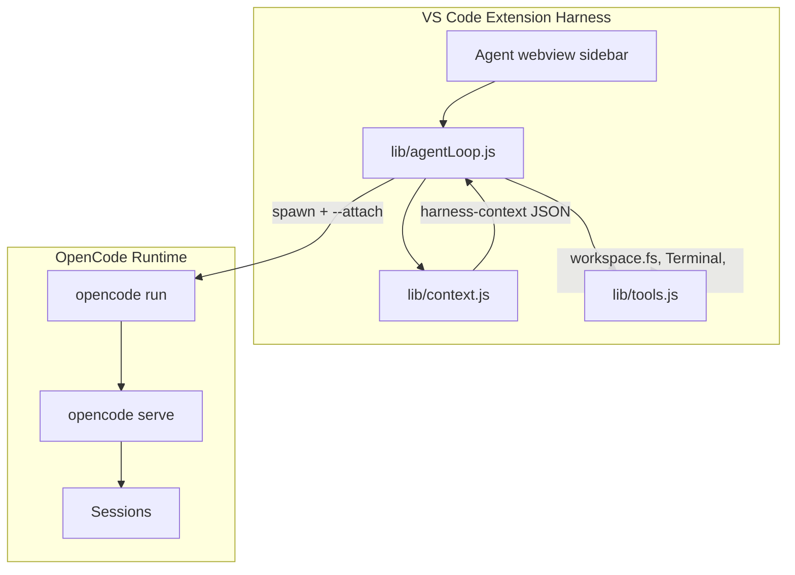
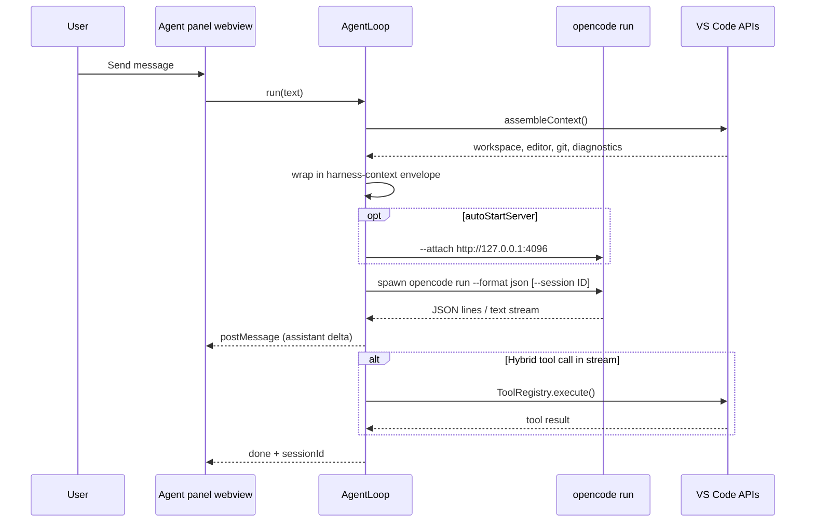

# Building the OpenCode Agent Harness: Editor-Native AI Without Leaving VS Code

**June 2026** · OpenCode Walkthrough extension

If you've used OpenCode from the terminal, you know the TUI is powerful — agents, MCP servers, multi-step sessions, the works. But until recently, the **OpenCode Walkthrough** VS Code extension treated that runtime as a black box: it opened a terminal, ran a command, and stepped back.

We wanted something closer to what developers expect from modern coding agents: context from the editor, a chat surface in the sidebar, session resume from a tree view, and a harness that orchestrates the loop while **OpenCode remains the engine**.

This article is the story of how we built that harness — inspired by the VS Code team's writing on [coding agent harnesses](https://code.visualstudio.com/blogs/2026/05/15/agent-harnesses-github-copilot-vscode) and structured like João Moreno's [docfind post](https://code.visualstudio.com/blogs/2026/01/15/docfind): problem, inspiration, solution, hard parts, and how to try it yourself.

---

## On this page

- [The problem](#the-problem)
- [The inspiration](#the-inspiration)
- [The solution](#the-solution)
- [The challenge](#the-challenge)
- [How we built it](#how-we-built-it)
- [The results](#the-results)
- [Try it yourself](#try-it-yourself)

---

## The problem

OpenCode Walkthrough started as a **launcher and dashboard**. It could:

- Dispatch CLI commands to the integrated terminal (`sendToTerminal`)
- Show tree views for agents, models, MCP servers, and sessions
- Guide new users through a walkthrough

What it could **not** do:

| Gap | User impact |
|-----|-------------|
| No in-editor agent loop | Every task required switching to a terminal TUI |
| Run Inline ran diagnostics, not prompts | "Run Inline Prompt" showed version/auth output instead of accepting input |
| Sessions tree was read-only | Clicking a session dumped `session list` — no resume |
| No `opencode serve` integration | Headless server was terminal-only |
| No tool confirmation | File edits and shell commands had no VS Code gate |

Together with Nick Trogh's docfind research mindset — *evaluate alternatives, then build the smallest thing that hits the sweet spot* — we mapped the landscape:

| Option | Verdict |
|--------|---------|
| **Terminal-only** | Works, but no editor context, no undoable edits, no sidebar chat |
| **Reimplement OpenCode in JS** | Duplicates agents, MCP, compaction — unmaintainable |
| **OpenCode web UI in iframe** | Extra auth/hosting; weak integration with diagnostics, SCM, trust |
| **Thin harness + OpenCode CLI** | ✅ OpenCode runs tools; extension assembles context and surfaces UI |

We chose the last path: a **thin harness layer** in plain JavaScript, no bundler, matching the rest of the extension.

---

## The inspiration

Two ideas shaped the design.

### 1. The model is the engine; the harness is the car

The [VS Code agent harness blog](https://code.visualstudio.com/blogs/2026/05/15/agent-harnesses-github-copilot-vscode) breaks every coding agent into four responsibilities:

1. **Context assembly** — what the model sees
2. **Tool exposure** — which capabilities exist
3. **Tool execution** — run, validate, feed results back
4. **Agent loop** — iterate until done, cancelled, or limited

OpenCode already covers (2)–(4) inside its CLI, TUI, and `opencode serve` session API. Our job was (1) plus **VS Code–native affordances**: selection, diagnostics, git status, trust checks, and a chat webview.

### 2. Client-side orchestration, server-side intelligence

The [docfind](https://code.visualstudio.com/blogs/2026/01/15/docfind) story is about pushing work to the edge (the browser) while keeping heavy indexing offline. Our analogue:

- **Build time / CLI side:** OpenCode indexes the repo, runs agents, talks to MCP
- **Extension side:** Assemble a compact context envelope, spawn `opencode run --format json`, stream output into a webview

No duplicate LLM stack in the extension. One process boundary: `opencode` as a child process.

---

## The solution

### Architecture



### One user turn



### Module layout

We split `extension.js` into nine focused modules under `lib/`:

| Module | Responsibility |
|--------|----------------|
| `env.js` | Map VS Code settings → `OPENCODE_*` environment variables |
| `cli.js` | `exec` / `spawn` helpers, workspace cwd |
| `health.js` | CLI install + auth probe on activate |
| `sessions.js` | `session list` with JSON-first, text fallback |
| `server.js` | Start/stop `opencode serve` in a dedicated terminal |
| `context.js` | Assemble editor/workspace/git/diagnostics envelope |
| `tools.js` | VS Code adapters + confirmation gates |
| `agentLoop.js` | Spawn `opencode run`, parse stream, cancel |
| `agentPanel.js` | Sidebar webview chat UI |

### Context envelope

Privacy-conscious defaults: file **contents** are off; metadata, selection, diagnostics, and git are on.

```javascript
// lib/context.js — toggles (defaults)
const DEFAULT_TOGGLES = {
  includeWorkspace: true,
  includeOpenEditors: true,
  includeActiveFile: true,
  includeSelection: true,
  includeDiagnostics: true,
  includeGit: true,
  includeFileContents: false,  // opt-in: privacy-sensitive
};
```

Each harness-initiated message appends a structured block:

```xml
<harness-context>
{
  "timestamp": "2026-06-21T20:00:00.000Z",
  "customInstructions": "Be concise.",
  "workspace": [{ "name": "my-app", "path": "/Users/dev/my-app" }],
  "activeEditor": { "path": "...", "language": "typescript", "selection": { "text": "..." } },
  "diagnostics": [{ "file": "...", "line": 42, "severity": "error", "message": "..." }]
}
</harness-context>
```

Users control sections via `opencode.harness.context.*` settings and `opencode.harness.customInstructions`.

### Agent loop

The loop spawns OpenCode once per user message and lets the CLI handle multi-step tool use internally. The extension streams output and optionally executes **hybrid** tool calls through VS Code:

```javascript
// lib/agentLoop.js — core spawn args
const args = ['run', '--format', 'json'];
if (this.sessionId) args.push('--session', this.sessionId);
if (serverUrl) args.push('--attach', serverUrl);
args.push(fullMessage);  // user text + harness-context
```

Cancellation kills the child process with `SIGTERM` — the same mental model as stopping a long terminal command.

### UI: Agent sidebar webview

Following the docfind principle of **one cohesive surface** (single WASM module) we ship one sidebar view: `opencode-walkthrough.agent`.

- Message list (user / assistant / tool / error)
- Textarea + Send / Cancel / Open TUI
- Status line with health message and session id prefix

Commands wired in the manifest:

- `OpenCode: Start Agent Session`
- `OpenCode: Cancel Agent`
- `OpenCode: Open Agent Panel`
- `OpenCode: Resume Session` (from Sessions tree)

---

## The challenge

Three areas were harder than wiring another `sendToTerminal` command.

### 1. OpenCode CLI surface area

`opencode run` exposes `--format json`, `--session`, `--attach`, and `--continue`. The server API is still evolving. We pin behavior to **spawn + line-delimited JSON** with a plain-text fallback when parsing fails — so a CLI upgrade does not brick the webview.

### 2. Hybrid tools vs CLI-native tools

OpenCode's built-in read/edit/bash tools run inside the CLI. The harness **ToolRegistry** handles VS Code–native execution when JSON events include tool calls — with `always` / `smart` / `never` confirmation for destructive operations and a hard stop when the workspace is untrusted.

### 3. Fixing launcher debt while adding the harness

Phase 0 bugs had to land in the same pass:

| Issue | Fix |
|-------|-----|
| Run Inline ignored user input | Input box → `opencode run "prompt"` |
| Sessions empty state broken constructor | Pass `cmd` as 5th arg, not 4th |
| MCP provider used `mcp ls` | Aligned to `mcp list` |
| Session tree did not resume | `resumeSession` command + session id in `arguments` |

---

## How we built it

We kept the extension **plain CommonJS** — no TypeScript, no webpack — so contributors can read any file top-to-bottom in one sitting.

**Test-first context assembly.** `assembleContextFromData()` accepts plain objects so `test/harness.test.js` runs eight unit tests without a live LLM or mocked VS Code workspace:

- Toggle respect (selection, file contents, git)
- Session JSON vs plain-text parse
- Tool event parsing
- ANSI strip for CLI stderr

**Extension integration tests** grew from 7 to 17: new commands registered, harness settings in `package.json`, Agent webview contributed.

**Manifest validation** in CI knows about the new webview provider:

```javascript
const registeredWebviews = new Set(['opencode-walkthrough.agent']);
```

The feature plan lives in [`.github/FEATURE_PLAN_opencode-agent-loop.md`](../.github/FEATURE_PLAN_opencode-agent-loop.md); this article documents what actually shipped in commit `dd2212a` on branch `ci/github-actions-collaboration`.

---

## The results

Today the OpenCode Walkthrough extension provides:

| Metric | Value |
|--------|-------|
| **Harness modules** | 9 files under `lib/` |
| **New commands** | 4 (start, cancel, open panel, resume session) |
| **Settings** | 12 harness + context toggles |
| **Tests** | 17 passing (`npm test`) |
| **Manifest commands** | 30 contributed |

What users get:

- **Agent chat** in the OpenCode activity bar without leaving the editor
- **Context-aware prompts** — selection, diagnostics, git branch, open tabs
- **Session resume** from the Sessions panel tree
- **Optional auto-start** of `opencode serve` at `http://127.0.0.1:4096`
- **Debug trail** in the **OpenCode Agent** output channel

What we deliberately deferred (see feature plan Phases 2b–4):

- Full multi-round harness loop with tool-result feedback to the server API
- VS Code Chat Participant (`chatParticipants`) as a native Chat UI
- Containerized eval scenarios (VSC-Bench style)
- Token usage footer from `opencode stats`

The harness is the **editor-integrated layer**; power users still open the TUI with one click.

---

## Try it yourself

### Install the extension

Clone the repo and open it in VS Code Extension Development Host, or install from the Marketplace when published:

```bash
git clone https://github.com/aadorian/opencodeCLI.git
cd opencodeCLI
npm install
npm test
```

Press **F5** to launch the Extension Development Host.

### Prerequisites

1. Install the OpenCode CLI: `curl -fsSL https://opencode.ai/install | bash` or `npm install -g opencode-ai` (see [opencode.ai/docs](https://opencode.ai/docs))
2. Authenticate: `opencode auth login`
3. Open a **trusted** workspace folder

### Run an agent session

1. Open the **OpenCode** activity bar → **Agent** view  
2. Type a prompt (e.g. *Explain the diagnostics in my active file*)  
3. Press **Send** or run **OpenCode: Start Agent Session** from the Command Palette  

Optional settings (`settings.json`):

```json
{
  "opencode.harness.autoStartServer": true,
  "opencode.harness.serverUrl": "http://127.0.0.1:4096",
  "opencode.harness.toolConfirmation": "smart",
  "opencode.harness.customInstructions": "Prefer small, focused diffs.",
  "opencode.harness.context.includeFileContents": false
}
```

### Resume a session

1. Open **MCP Servers** panel → **Sessions** tree  
2. Click a session → enter a follow-up prompt  
3. The harness passes `--session <id>` to `opencode run`

### Read the code

| Path | Start here |
|------|------------|
| [`lib/agentLoop.js`](../lib/agentLoop.js) | Spawn, stream, cancel |
| [`lib/context.js`](../lib/context.js) | Context envelope |
| [`lib/agentPanel.js`](../lib/agentPanel.js) | Webview UI |
| [`extension.js`](../extension.js) | Command registration |

### Contribute

- [Good first issues (#17)](https://github.com/aadorian/opencodeCLI/issues/17)  
- [Agent Loop epic (#31)](https://github.com/aadorian/opencodeCLI/issues/31)  
- [Git workflow](../.github/GIT_WORKFLOW.md)

---

Building this harness was a reminder that the best VS Code extensions **meet developers where they already work** — same pattern as docfind meeting readers with instant search, and Copilot's harness meeting agents with editor context. OpenCode keeps the intelligence; we built the car.

If you have questions or feedback, open an issue on [github.com/aadorian/opencodeCLI](https://github.com/aadorian/opencodeCLI/issues).

Happy coding!
