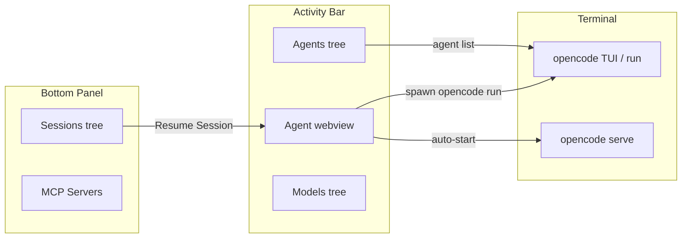

# Practical Workflow Examples

Step-by-step walkthroughs for common OpenCode tasks inside VS Code. These examples show **where to click**, **what appears in each surface**, and **how sessions hand off** between the Agent sidebar, integrated terminal, and tree views.

---

## On this page

- [Surfaces at a glance](#surfaces-at-a-glance)
- [Example 1: Multi-step plan → build handoff](#example-1-multi-step-plan--build-handoff)
- [Example 2: Agent harness chat with editor context](#example-2-agent-harness-chat-with-editor-context)
- [Example 3: Resume a session from the Sessions tree](#example-3-resume-a-session-from-the-sessions-tree)
- [Example 4: Run on project files (batch refactor)](#example-4-run-on-project-files-batch-refactor)
- [Example 5: Interactive TUI for long-running work](#example-5-interactive-tui-for-long-running-work)
- [Example 6: Custom agent + subagent handoff](#example-6-custom-agent--subagent-handoff)

---

## Surfaces at a glance

| Surface | Where | Best for |
|---------|-------|----------|
| **Agent** sidebar (`opencode-walkthrough.agent`) | OpenCode activity bar → Agent | In-editor chat, harness context, session resume |
| **MCP Servers** panel → **Sessions** tab | Bottom panel | Browse past sessions, click to resume |
| **Agents** / **Models** trees | OpenCode activity bar | Pick agents, inspect models |
| **Integrated terminal** (`OpenCode` or `OpenCode Server`) | Terminal panel | TUI, `opencode run`, `opencode serve` |
| **OpenCode Agent** output channel | Output panel | Harness debug log (spawn args, stream events) |
| **Status bar** | Bottom | `OpenCode` quick actions · `Agents` list |



---

## Example 1: Multi-step plan → build handoff

**Goal:** Ask OpenCode to plan a feature first, review the plan in the editor, then execute implementation — without leaving VS Code.

### Prerequisites

1. OpenCode CLI installed (`opencode --version` works in a terminal).
2. Auth configured (`opencode auth login`).
3. A **trusted** workspace folder open.

### Step 1 — Enable plan mode (optional)

Plan mode is an OpenCode CLI experimental feature. Map it through VS Code settings so every terminal command from the extension inherits it:

```json
{
  "opencode.experimental.planMode": true
}
```

This sets `OPENCODE_EXPERIMENTAL_PLAN_MODE=true` before each `sendToTerminal` dispatch (see [Troubleshooting](./troubleshooting.md) if env vars do not apply).

### Step 2 — Start in the Agent sidebar

1. Open the **OpenCode** activity bar.
2. Select **Agent**.
3. Confirm the header shows health, e.g. `OpenCode 0.x.x — ready`.
4. Type a planning prompt:

   > Plan a handoff flow: add a `UserProfile` component with avatar, display name, and email. List files to create, props, and test strategy. Do not edit files yet.

5. Press **Send** (or run **OpenCode: Start Agent Session** from the Command Palette).

### What you see in the Agent panel

| Phase | UI |
|-------|-----|
| After Send | Your message appears in a user bubble; status → `running` |
| While CLI works | Assistant bubble streams text; tool rows may appear as `Tool: read`, `Tool: grep`, etc. |
| On completion | Status shows `Session abc12345` (first 8 chars of session id) |
| On error | Red error bubble; status → `error` |

Behind the scenes the harness:

- Assembles a `<harness-context>` block (workspace path, active file, selection, diagnostics, git branch).
- Spawns `opencode run --format json [--attach http://127.0.0.1:4096]`.
- Streams JSON lines into the webview.

Open **View → Output → OpenCode Agent** to watch spawn args and stream parsing.

### Step 3 — Review, then hand off to implementation

1. Read the plan in the Agent chat.
2. Send a follow-up in the **same** sidebar (session id is preserved):

   > Implement step 1 only: create `UserProfile.tsx` with the props from your plan. Keep the diff small.

3. When hybrid tools run (file writes, terminal commands), VS Code may show a confirmation dialog depending on `opencode.harness.toolConfirmation` (`smart` by default).

### Step 4 — Verify in the editor

- New or changed files appear in the Explorer.
- Problems panel shows any new diagnostics (included in the next harness message if `opencode.harness.context.includeDiagnostics` is true).

### Alternative: plan in TUI, build in harness

1. **OpenCode: Start Interactive Session** → plan in the full TUI.
2. Note the session id from **Sessions** tree (bottom panel).
3. Click the session → enter a follow-up → harness resumes with `--session <id>`.

---

## Example 2: Agent harness chat with editor context

**Goal:** Fix the error on the line your cursor is on, using diagnostics the harness attaches automatically.

### Steps

1. Open a file with a TypeScript or ESLint error.
2. Place the cursor on the offending line (optional: select the symbol).
3. Open **Agent** sidebar.
4. Prompt:

   > Explain the diagnostic at my cursor and suggest a minimal fix.

5. Press **Send**.

### What the model receives

The harness appends JSON inside `<harness-context>` (file path, language, selection, diagnostics). File **contents** are off by default (`opencode.harness.context.includeFileContents: false`). Enable only when you need the model to see full buffer text.

### Status bar and health

If the header shows `OpenCode CLI is not installed` or `no providers configured`, fix install/auth before sending — see [Troubleshooting](./troubleshooting.md).

---

## Example 3: Resume a session from the Sessions tree

**Goal:** Continue yesterday's agent session from the bottom panel without re-pasting context.

### Steps

1. Open **MCP Servers** panel → **Sessions** tab.
2. Click a session row (or run **OpenCode: List Sessions** to refresh).
3. VS Code prompts for a follow-up message.
4. The harness calls `opencode run --session <id> --format json` with your new text + fresh harness context.

### What you see

| Location | Behavior |
|----------|----------|
| Input box | Pre-filled or empty follow-up prompt |
| Agent sidebar | Opens if needed; new user + assistant messages append |
| Sessions tree | Same session id; title may update after CLI sync |

Empty Sessions tree? Run any prompt first (**Run Inline Prompt** or **Start Agent Session**), then click **Refresh** on the Sessions toolbar.

---

## Example 4: Run on project files (batch refactor)

**Goal:** Refactor several files in one shot via the terminal (not the Agent webview).

### Steps

1. **OpenCode: Run on Project Files** (`Ctrl+Alt+P` / `Cmd+Alt+P`).
2. Multi-select files in the quick pick.
3. Enter prompt: `Refactor these files to use async/await consistently.`
4. Confirm — the extension opens the integrated terminal and runs:

   ```bash
   opencode run --file path/a.ts --file path/b.ts "Refactor these files..."
   ```

   (Exact flags depend on CLI version; env prefixes are injected per your `opencode.*` settings.)

### When to use this vs Agent sidebar

| Use Run on Project Files | Use Agent sidebar |
|--------------------------|-------------------|
| Explicit file list | Active editor + workspace context |
| One-shot terminal output | Streaming chat + session resume |
| No webview needed | Tool confirmations in VS Code |

---

## Example 5: Interactive TUI for long-running work

**Goal:** Multi-hour exploratory work with OpenCode's full TUI (MCP, agents, compaction).

### Steps

1. **OpenCode: Start Interactive Session** (or welcome link **Start Interactive Session**).
2. Terminal opens (reuses active terminal if named `OpenCode`).
3. Full TUI runs — use `/help`, switch agents, attach MCP servers.

From the Agent sidebar, click **Open TUI** anytime to jump to the same terminal command.

### Server auto-start

With `opencode.harness.autoStartServer: true` (default), the first Agent message may also open an **OpenCode Server** terminal running `opencode serve --hostname 127.0.0.1 --port 4096`. The harness passes `--attach` so `opencode run` shares server-side session state.

---

## Example 6: Custom agent + subagent handoff

**Goal:** Create a reviewer agent, list it in the sidebar, then invoke it from a harness prompt.

### Steps

1. **OpenCode: Create Agent** → complete CLI wizard in terminal.
2. Open **Agents** tree → confirm `code-reviewer` (or your name) appears.
3. In **Agent** sidebar, prompt:

   > Use the code-reviewer agent to review `src/api.ts` for error handling gaps.

   (If your CLI supports `--agent`, the harness can pass it when resuming from the Agents tree; otherwise name the agent in the prompt.)

4. For background subagents (experimental):

   ```json
   {
     "opencode.experimental.backgroundSubagents": true
   }
   ```

5. Watch the Agent panel for tool rows and the terminal for parallel subagent output.

---

## Quick reference: commands used in these flows

| Command | ID |
|---------|-----|
| Start Agent Session | `opencode-walkthrough.startAgent` |
| Open Agent Panel | `opencode-walkthrough.openAgentPanel` |
| Cancel Agent | `opencode-walkthrough.cancelAgent` |
| Resume Session | `opencode-walkthrough.resumeSession` |
| Run Inline Prompt | `opencode-walkthrough.runInline` |
| Run on Project Files | `opencode-walkthrough.runOnProject` |
| Start Interactive Session | `opencode-walkthrough.runInteractive` |
| Start Server | `opencode-walkthrough.serve` |

Full command catalog: [Repository README](../README.md#commands).

---

## Related articles

- [Building the OpenCode Agent Harness](./building-opencode-agent-harness.md) — architecture and design
- [Troubleshooting](./troubleshooting.md) — PATH, env vars, terminal shells
- [OpenCode CLI docs](https://opencode.ai/docs)
