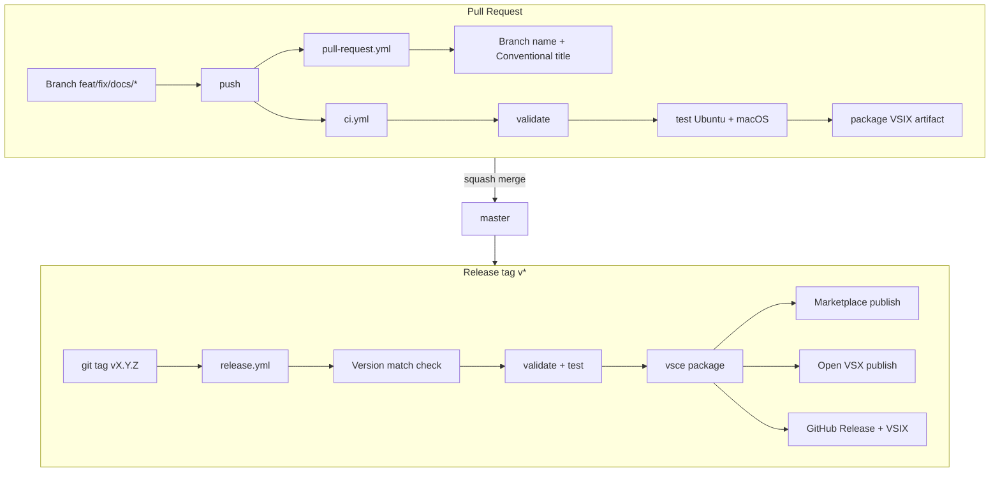

# Publishing & CI/CD Strategy

How **OpenCode Walkthrough** is built, tested, packaged, and published to the [VS Code Marketplace](https://marketplace.visualstudio.com/items?itemName=AlejandroAdorjan.opencode-walkthrough), following [Publishing Extensions](https://code.visualstudio.com/api/working-with-extensions/publishing-extension) and [Continuous Integration](https://code.visualstudio.com/api/working-with-extensions/continuous-integration) guidance.

Official references:

- [Publishing Extensions](https://code.visualstudio.com/api/working-with-extensions/publishing-extension)
- [Continuous Integration](https://code.visualstudio.com/api/working-with-extensions/continuous-integration)
- [Testing Extensions](https://code.visualstudio.com/api/working-with-extensions/testing-extension)
- [Git workflow](../.github/GIT_WORKFLOW.md) (repository branching and releases)

---

## On this page

- [Pipeline overview](#pipeline-overview)
- [Pull request pipeline](#pull-request-pipeline)
- [Main branch CI](#main-branch-ci)
- [Release pipeline](#release-pipeline)
- [Publisher & secrets](#publisher--secrets)
- [Marketplace checklist](#marketplace-checklist)
- [Pre-release extensions](#pre-release-extensions)
- [Local publishing](#local-publishing)
- [Future: Entra ID publishing](#future-entra-id-publishing)
- [Related articles](#related-articles)

---

## Pipeline overview



| Stage | Trigger | Workflow | Outcome |
|-------|---------|----------|---------|
| **PR checks** | PR to `master` | `pull-request.yml`, `commitlint.yml` | Branch/title conventions, labels |
| **CI** | Push / PR to `master` | `ci.yml` | Validate, test, VSIX artifact |
| **Release** | Tag `v*` | `release.yml` | Marketplace + Open VSX + GitHub Release |
| **Wiki sync** | Push `docs/**` to `master` | `sync-wiki.yml` | GitHub Wiki updated |

---

## Pull request pipeline

Every PR must follow [Conventional Commits](https://www.conventionalcommits.org/) and branch naming (`feat/`, `fix/`, `docs/`, `ci/`, etc.). See [Git workflow](../.github/GIT_WORKFLOW.md).

### Automated PR gates (`pull-request.yml`)

| Check | Purpose |
|-------|---------|
| Branch naming | Enforces `type/description` pattern |
| Semantic PR title | `feat:`, `fix:`, `docs:`, … |
| Review guide comment | Links to F5 testing and checklist |
| Labeler | Auto-labels by changed paths |

### Commit lint (`commitlint.yml`)

Validates each commit message in the PR against `.github/commitlint.config.mjs`.

### Developer checklist before merge

```bash
npm ci
npm run validate   # manifest + Marketplace prerequisites
npm test           # extension + unit tests
npm run run        # Extension Development Host (optional)
```

Download the **VSIX artifact** from the PR **Checks** tab to sideload:

```bash
code --install-extension opencode-walkthrough-0.0.3.vsix
```

---

## Main branch CI

Workflow: [`.github/workflows/ci.yml`](../.github/workflows/ci.yml)

### Job 1 — Validate

Runs `npm run validate` (`scripts/validate-manifest.js`), which checks:

- `package.json` commands, walkthroughs, activation events
- Marketplace prerequisites via `lib/publishCicd.js`:
  - `publisher`, `engines.vscode`, semver `version`
  - PNG icon (not SVG — [vsce constraint](https://code.visualstudio.com/api/working-with-extensions/publishing-extension))
  - `README.md`, `LICENSE`, `CHANGELOG.md`
  - ≤ 30 `keywords`
  - Required workflows: `ci.yml`, `release.yml`, `pull-request.yml`
  - `vscode:prepublish` script present

### Job 2 — Test (matrix)

| OS | Runner | Command |
|----|--------|---------|
| Ubuntu | `ubuntu-latest` | `xvfb-run -a npm test` |
| macOS | `macos-latest` | `npm test` |

Uses `@vscode/test-cli` with tests in `test/**/*.test.js`.

### Job 3 — Package

```bash
npx @vscode/vsce@3 package --no-dependencies
```

Produces `opencode-walkthrough-<version>.vsix`, verified and uploaded as a **14-day artifact** for PR review and traceability.

`.vscodeignore` excludes dev-only files (`test/`, `.github/`, `.vscode-test/`, etc.) per [vsce packaging](https://code.visualstudio.com/api/working-with-extensions/publishing-extension#_packaging-extensions).

---

## Release pipeline

Workflow: [`.github/workflows/release.yml`](../.github/workflows/release.yml)

Releases are **tag-driven** — version is not bumped on every merge.

### Cut a release

1. Update `version` in `package.json` and `CHANGELOG.md`
2. Commit: `chore: release v0.0.4`
3. Tag and push:

   ```bash
   git tag v0.0.4
   git push origin master --tags
   ```

### Release job steps

| Step | What it enforces |
|------|------------------|
| **Version match** | Tag `v0.0.4` must equal `package.json` `version` |
| **Validate + test** | Same gates as CI |
| **Package** | `vsce package --no-dependencies` |
| **Pre-release flag** | `--pre-release` when `preview: true` or tag contains `-` |
| **Marketplace** | `vsce publish --packagePath <vsix>` with `VSCE_PAT` |
| **Open VSX** | `ovsx publish` with `OVSX_PAT` |
| **GitHub Release** | Attaches VSIX; marks pre-release when applicable |

Publisher ID: **`AlejandroAdorjan`** → extension id `AlejandroAdorjan.opencode-walkthrough`.

### Auto-increment (optional)

For manual releases, [vsce supports](https://code.visualstudio.com/api/working-with-extensions/publishing-extension#_auto-increment-the-extension-version):

```bash
npx @vscode/vsce publish minor   # 0.0.3 → 0.1.0
```

This repository prefers **explicit version bumps** in `package.json` + git tags so CI and changelog stay in sync.

---

## Publisher & secrets

### Create a publisher

Per [Microsoft docs](https://code.visualstudio.com/api/working-with-extensions/publishing-extension#create-a-publisher):

1. [Manage publishers](https://marketplace.visualstudio.com/manage)
2. Create publisher **`AlejandroAdorjan`** (matches `package.json`)
3. Authenticate with `vsce login AlejandroAdorjan` (local) or CI secrets

### GitHub Actions secrets

| Secret | Used for | Scope |
|--------|----------|-------|
| `VSCE_PAT` | VS Code Marketplace | Azure DevOps PAT — **Marketplace (Manage)** |
| `OVSX_PAT` | [Open VSX](https://open-vsx.org) | Personal access token |

If a secret is missing, the release workflow **skips** that publish step with a warning (VSIX and GitHub Release still publish).

Store tokens in repo **Settings → Secrets and variables → Actions**. Never commit `.env` with real PATs.

---

## Marketplace checklist

Aligned with [Marketplace presentation tips](https://code.visualstudio.com/api/working-with-extensions/publishing-extension#_marketplace-integration):

| Requirement | This extension |
|-------------|----------------|
| `README.md` | Root — screenshots, commands, settings |
| `CHANGELOG.md` | Root — release notes |
| `LICENSE` | Root |
| `icon` | `media/opencode-icon.png` (128×128+ PNG) |
| `galleryBanner` | Dark theme in `package.json` |
| `pricing` | `"Free"` |
| `repository` | GitHub URL for relative link resolution |
| `engines.vscode` | `^1.74.0` |
| No SVG in icon/badges | PNG icon; SVG excluded via `.vscodeignore` |
| HTTPS images in README | Required by vsce validation |

---

## Pre-release extensions

This extension sets `"preview": true` in `package.json`. The release workflow publishes with **`--pre-release`** until `preview` is set to `false`.

VS Code rules ([docs](https://code.visualstudio.com/api/working-with-extensions/publishing-extension#_pre-release-extensions)):

- Pre-release and stable versions must use **distinct** version numbers
- Recommended pattern: even patch for stable (`0.2.x`), odd for pre-release (`0.3.x`)
- `engines.vscode` must be `>= 1.63.0` for pre-release support (we use `^1.74.0`)

---

## Local publishing

### Package only (no upload)

```bash
npm run publish   # npx @vscode/vsce package --no-dependencies
```

Install locally:

```bash
code --install-extension opencode-walkthrough-0.0.3.vsix
```

### Publish to Marketplace (manual)

```bash
# From .env.example — never commit real tokens
npx @vscode/vsce publish --no-dependencies -p "$VSCE_PAT"
```

### Publish to Open VSX (manual)

```bash
npx ovsx publish opencode-walkthrough-0.0.3.vsix -p "$OVSX_PAT"
```

---

## Future: Entra ID publishing

Microsoft [recommends](https://code.visualstudio.com/api/working-with-extensions/publishing-extension#_secure-automated-publishing-to-visual-studio-marketplace) **Microsoft Entra ID** with workload identity federation instead of long-lived PATs (global PATs retire **December 1, 2026**).

Migration path for this repo:

1. Create Azure managed identity + federated credential
2. Add identity as **Contributor** on the Marketplace publisher
3. Replace `VSCE_PAT` in `release.yml` with:

   ```bash
   vsce publish --azure-credential --packagePath opencode-walkthrough-<version>.vsix
   ```

Until migration, `VSCE_PAT` remains supported with scoped **Marketplace (Manage)** tokens.

---

## Related articles

- [Installing OpenCode](./installation.md)
- [Troubleshooting](./troubleshooting.md)
- [Practical Workflow Examples](./practical-workflow-examples.md)
- [Repository README](../README.md#publishing)
- [VS Code — Publishing Extensions](https://code.visualstudio.com/api/working-with-extensions/publishing-extension)
